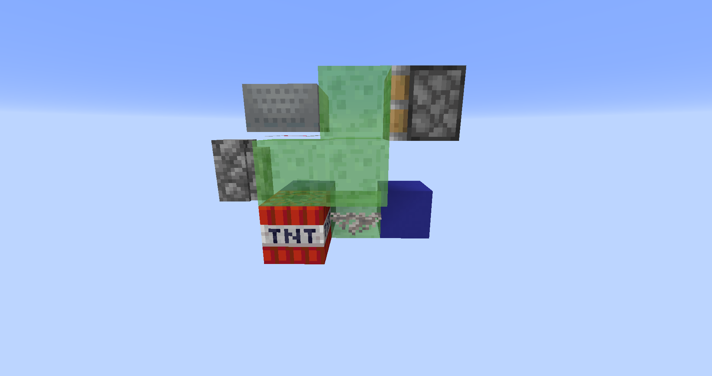
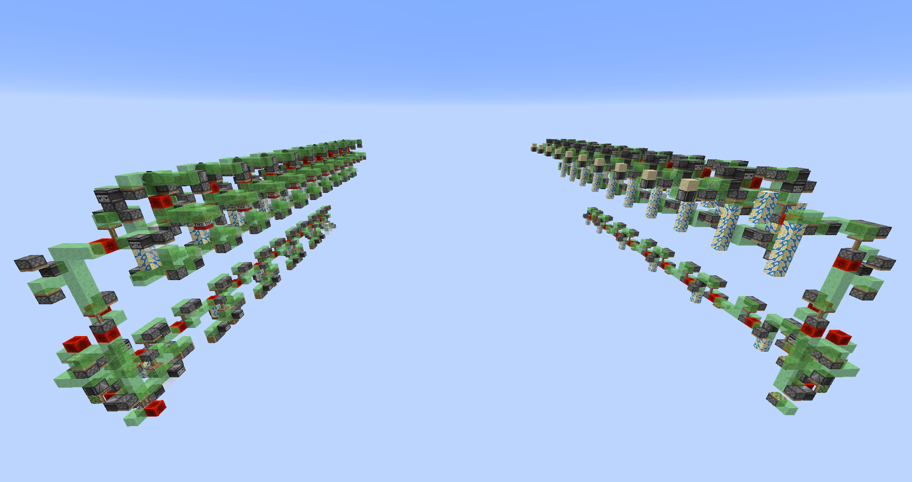
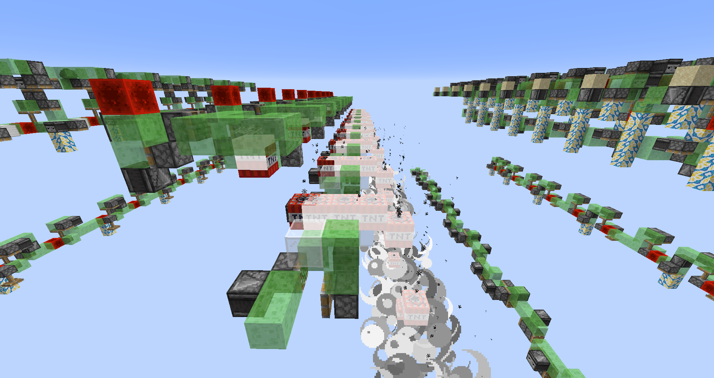

<!-- TOC -->

- [TNT和爆炸](#tnt和爆炸)
- [当活塞开始推动](#当活塞开始推动)
- [刷地毯机、刷铁轨机、TNT复制机](#刷地毯机刷铁轨机tnt复制机)
- [练习](#练习)
- [空置域](#空置域)
  - [三向轰炸机](#三向轰炸机)
  - [ilmango的世界吞噬者](#ilmango的世界吞噬者)
  - [Fallen_Breath和星空花夜丶的地狱吞噬者](#fallen_breath和星空花夜丶的地狱吞噬者)
  - [下推排水机、安全连杆](#下推排水机安全连杆)

<!-- /TOC -->

# TNT和爆炸

TNT是红石元件，其被激活时会点燃。除此之外，打火石、火焰弹、发射器发射、带有火矢的箭、火、岩浆等多种方式都可以点燃TNT。

TNT点燃后，在原方块位置底面中心点，即(+0.5, 0, +0.5)生成一个TNT实体，其是一个棱长为0.98的正方体。随后删除原方块。如果TNT被激活或被打火石引燃，其会在80游戏刻后爆炸；如果它因爆炸而被点燃，则它会在10至30游戏刻后爆炸。一般我们讨论的都是由红石电路激活的TNT。爆炸倒计时由Fuse标签记录，刚被点燃时，记为80，不断递减，为0时立即爆炸，删除TNT实体。

爆炸将会产生在TNT地面正中心向上0.06125（=0.98÷16）格。爆炸威力$P$为4，爆炸威力决定物品的掉落率：掉落率=1÷爆炸威力（龙蛋、信标、潮涌核心、头颅、潜影盒总是掉落）。常见的爆炸和威力如下：

- 凋灵生成：7
- 末影水晶爆炸：6
- 闪电苦力怕：6
- 床、重生锚：5（生成火）
- TNT：4（100%掉落）
- 苦力怕：3
- 恶魂火球：1（生成火）
- 凋灵之首：1（蓝色凋灵之首将大部分方块的爆炸抗性视为不超过0.8）

爆炸是即时且独立的，即爆炸产生后立即计算结果并对世界产生影响。如果同一游戏刻有多个爆炸产生，则它们分别计算。每个爆炸结束后再进行下一个爆炸的计算。这意味着不可能用多个TNT爆炸炸毁一个TNT理论上所不能炸毁的方块，方块并不存在某种“爆炸生命值”。

从爆心开始，爆炸会产生1352条爆炸射线：其构成以爆心为中心的一个立方体的表面，每个表面都被均匀地按正方形投射了16×16的爆炸射线。每条射线都有爆炸威力×（0.7\~1.3）的初始爆炸强度，对TNT来说就是2.8\~5.2。爆炸每沿射线方向前进0.3格就衰减0.225，且非空气方块还会使爆炸强度再下降(爆炸抗性+3)×0.3。所有衰减分段采样点上未能使爆炸强度衰减到0的方块都会被破坏。破坏是在所有射线计算完毕后进行的，因此每个方块可以吸收多条爆炸射线或一条爆炸射线的多个分段采样点，即使这个方块很容易被爆炸破坏。爆炸射线的分段采样点只考虑采样点的方块坐标，而不考虑是否位于碰撞箱内。这意味着在半砖上爆炸的TNT总会被半砖吸收大量的爆炸射线，落在末影箱上的TNT会隔绝一切爆炸，达到防爆的效果。

水和岩浆的爆炸抗性是100，TNT在水和岩浆中爆炸则无法破坏任何方块。

//在这里加一张由指令生成的巨大爆炸威力的图片。

爆炸半径$r=2P$。以爆心为中心，$r$为半径的球体是爆炸的伤害范围，在伤害范围内的所有实体（底面中心点，距离爆心为$d$）都会受到影响。爆炸冲击力$v=(1-d/r)α$，其中$α$是爆炸接触率。实体受到的伤害为$7(v^2+v)P+1$的向下取整。实体获得从爆心向实体的眼部高度中心（TNT仍是底面中心）方向，大小为$v$的速度。这意味着多个TNT可以造成更多的伤害，增加更多的速度。此外，在同一游戏刻需要运算多个TNT时，对每个TNT进行运算后才会进行下一个TNT的运算，轨迹相同的TNT会因此而被分开。

爆炸接触率是从爆心向实体内部若干网格点的连线中，没有被阻挡的比率。网格点取点的位置并不均衡，数量则和实体的大小有关，实体越大取点越多。没有阻挡时，爆炸接触率自然是100%。

TNT实体生成后，会得到0.2m/gt向上的垂直速度，和0.02m/gt的随机水平方向速度。TNT是ASD实体，重力加速度0.04，阻尼0.98，终端速度1.96。当TNT上方无方块遮挡时，4gt后达到最高点，此时向上跃起0.384格，累计向下掉落73.454格；当TNT上方有方块阻挡时，TNT会在1gt之内向上跃起0.02格，随后触顶而速度归零，接下来自由落体79.865格，累计向下掉落或79.845格。

1.14的快照19w11a之前，TNT爆炸破坏36号方块（Moving Piston）时会有100%的掉落率，而破坏一般的方块只有25%的掉落率。19w11a之后，TNT和TNT矿车的掉落率都变为100%。不过玩家仍然会让被TNT炸掉的方块处于36号方块的状态，因为36号方块有更低的爆炸抗性（0），同一个TNT可以破坏更多的方块。

1.14加入了流浪商人，其使沙子可再生，进而使TNT可再生。在此之前，生存玩家一般使用刷沙机或TNT复制机来制作大量TNT。

# 当活塞开始推动

在1.9的快照15w42a中，Myren Eairo发现了TNT复制的方法：用活塞推动处于BUD态的TNT。此时TNT正常推出，但TNT实体仍旧会生成。这一BUG随后被修复，但修复不完全，TNT复制机的设计方案如雨后春笋般冒了出来，直到现在（1.18.1）都有大量可用的TNT复制方案。

上图是一个可用的TNT复制，粘性活塞收回时TNT将被复制。该BUG同样利用了处于BUD态的TNT，但现在装置下方有一个失活的珊瑚扇。这一装置在1.13以后可以稳定运行，而1.13也是NC更新和PP更新成型的时期，我们以这个版本为例介绍TNT复制的原理。

珊瑚扇提供了TNT复制所需要的方块更新。为了解释TNT是如何复制的，我们首先介绍活塞是如何处理运动方块和附着的方块的。

当活塞激活时，其首先会自检，检查自己能否推出。活塞满足推出条件后，它会将所有需要移动的方块计入列表。该列表的排列顺序，就是我们在活塞更新次序理论中介绍过的顺序。另外，被破坏的方块也会被计入另一个列表，顺序也遵循更新次序理论。

现在，活塞开始移动，其首先破坏应当破坏的方块，西瓜块在这一阶段被破坏，这一阶段不产生方块更新，地毯悬空，不会掉落。西瓜在这里应当产生NC更新，缺失的NC更新会在所有PP更新结束后再发出。

此后，活塞按次序在相应位置放置36号方块，如果该位置有方块则会直接被替换掉。放置36号方块的过程产生PP更新，火把因此掉落。地毯收到了PP更新，但不会掉落，因为地毯可以附着在任何非空气方块上，也包括36号方块。

最后，是那些没有被替换却应当被删除的方块，例如红石火把下方的粘液块，都会在这一阶段被删除。所有应当被删除的方块被放入一个哈希集中，产生PP更新，因而它们的顺序是按位置随机的，红石火把在这里一阶段掉落。被删除的方块都是不应当存在的，因此不会产生破坏音效和掉落物。（1.15后，游戏会先将所有方块无更新地替换为空气，再统一发出PP更新）

[-_-]:1.15之后这里会先把所有方块替换为空气，再由空气发出PP更新。

现在开始NC更新，所有被破坏的方块按顺序发出NC更新，例如这里的西瓜。如果地毯位置是铁轨则会在这一阶段掉落，铁轨在收到NC更新时检查，其下必须是表面完整的方块，36号方块表面不完整。最后是所有被移动的方块按顺序发出NC更新。

而后，活塞携带粘液块结构正常推出。

总的来看，活塞运动前会在它们的目的地放置36号方块，并将每个方块删除，在上述位置产生NC更新和PP更新。但方块的最前端例外，它只产生PP更新而不产生NC更新。我们在方块更新和方块变化一节中提到，常规BUD不响应方块的移入，而观察者却会响应，就是由于这个原因。

如上的装置也可说明这一点，落下拉杆，最前端的铁轨并不会立即掉落，它会在铁块就位后收到NC更新，进而掉落。

当活塞要移除一些方块时，如破坏应当破坏的方块、用36号方块替换原先的方块时，这些方块的更新往往被抑制，如铁轨被移除时就不产生任何额外的更新。但有些方块可能产生额外的更新，如活塞破坏红石线时的方块更新就是在这时产生的。除此之外，观察者的更新都不会被抑制。

现在我们总结活塞推动瞬间所发生的事情：
- 自检
- 破坏方块，不产生更新
- 创建36号方块，产生PP更新
- 删除方块，哈希顺序，产生PP更新
- 被破坏了的方块产生NC更新
- 被移动了的方块产生NC更新

其中，如果涉及到了一些额外的方块，如观察者、红石线等，则先去完成它们自身的更新，再继续推动过程。

# 刷地毯机、刷铁轨机、TNT复制机

这是一台刷地毯机，每次粘性活塞收回时，都会有一个地毯刷出。

首先，创建移动方块列表。最先移动的是下方粘液块，其次是珊瑚扇，产生PP更新，但原先的珊瑚扇还未删除，且此时附着在珊瑚扇的36号方块上，因而被破坏，产生NC更新和PP更新。地毯因为下方珊瑚扇被破坏而掉落。之后，创建上方粘液块和地毯的36号方块。此后活塞正常收回，地毯被复制。

当活塞推出时，并不会有这样的问题。首先创建珊瑚扇的36号方块，用下方粘液块的36号方块替换珊瑚扇，更新到地毯，不过地毯可以附着在36号方块上，所以并不会掉落。接着放置地毯的36号方块，用上方粘液块的36号方块替换地毯。其后活塞推出。

而TNT复制机的原理，无非就是将地毯换为了BUD态的TNT而已。

[>_<]: 这里多几个刷地毯机和刷铁轨机

这是一台刷铁轨机，这个机器只有在活塞推出时，且是在活塞刚收回后又被观察者激活才会刷出铁轨。

活塞收回完毕后，两个观察者都准备激活，由于NTE优先于BE，活塞准备推出时两个观察者都是点亮的。活塞推出后，先移动最下层粘液块，发出PP更新，铁轨不会掉落。接着移动观察者，观察者本身处于激活状态，所以被移动时要产生额外的更新信号，这个更新信号是完整的，包含NC和PP更新。铁轨因而检查到其下是36号方块而掉落，这就复制了铁轨。

这个装置不仅可以复制动力铁轨，也可以复制其他任意类型的铁轨。

地毯可以附着在36号方块上，所以不能用这种方法刷取。不过我们可以在刷铁轨的同时刷一些地毯。

如下是TNT复制机。TNT处于BUD态，信号源是上方矿车和探测铁轨。圆石墙用于拦住矿车，防止它从机器上掉下去。TNT是在活塞收回时复制的。

TNT处于BUD态，所以这种机器很危险，在制作时要时刻小心不能更新到TNT，以防“炸膛”。制作机器时可以通过活塞将探测铁轨和活塞推到正确的位置，或者将机器拆成两部分，让活塞推出收回一次来装配好这个复制机，比如下面这样：

下面这个有趣的TNT复制机会在活塞推出时复制TNT，然后将TNT弹射出去！

下面这个TNT复制机可以在活塞推出和收回时分别复制一个TNT，原理是后面两个蓝色混凝土的36号方块更新珊瑚扇，进而更新TNT。

在生存游戏中，玩家可以利用TNT复制机破坏地形，清除一定区域内的方块，以期制作各种形式的农场。有意思的是，有些玩家会用TNT复制机来制作史莱姆农场，那么在没有粘液块前该如何制作TNT复制机呢？在“节省耗材”的口号下，无粘液块、无粘性活塞甚至无珊瑚扇的TNT复制机都被制作出来了，如下便是一例。

TNT被推出，随后被另一侧的活塞复位。复位的活塞推出时TNT复制。复位活塞是被观察者激活的，而观察者给出信号时，改变了黄色混凝土的指向，使之不能充能左侧的混凝土，进而无法激活背后的TNT。此后复位活塞开始推出，观察者被推动，发出NC更新和PP更新使得黄色位置红石线失去信号，强度降为13，同时指向混凝土。

此时能否复制TNT，还需要看究竟是活塞先将TNT推走，还是红石线先更新到TNT。红石线全部更新完之后活塞才会继续推动，想要让TNT复制，则红石线必须在熄灭前更新到TNT。这是可以做到的，半砖上的红石线若要熄灭必须更新到TNT，如果它不更新到TNT，则必须维持11强度，此时黄色位置红石线强度至少为7。所以黄色位置和半砖位置的红石线至少有一个会更新到TNT。

# 练习

思考：携带TNT和必要的方块，如何在挖掘疲劳的负面效果下，快速攻略海底神殿？

思考：设计实验证明活塞在将方块转变为36号方块时，PP更新总优先于NC更新。

思考：设计实验证明，活塞在删除多余方块时发出的PP更新的顺序并不一定遵循更新次序理论。

思考：为什么火把和死珊瑚扇都不能附着在36号方块上，前者在粘液块移动时会被破坏，而后者则不会。

思考：比较三台机器在激活和撤销激活时，分别会产生几次珊瑚破坏的音效，为什么？

思考：这两台机械，在活塞伸出收回一次可以复制几个地毯，分别是在什么时候？

思考：这样可以复制铁轨吗？

# 空置域

将TNT复制机与粘液块飞行器结合，我们就得到了一台“轰炸机”。由于TNT在点燃后可以自由落体约80格，像这样的轰炸机可以在移动时将其下80格的方块破坏掉，这使得破坏大规模地形成为可能。

我们又不是熊孩子，为什么要大规模破坏地形呢？事实上，在生存游戏中，清空一个甚至一大片区块，使之只保留基岩是一件非常有意义的事——这使得周围的区块中没有可以刷怪的地方，极大地提高刷怪塔的效率。发展到现在，清空区块而仅仅用作装饰用途的玩家甚至也不在少数。

然而，在TNT复制出现前，清空区块是一件消耗大量人力成本的事，这使得很多玩家对此望而却步，一般只有大型的生存服务器，才会将这样方案纳入考虑之中。比起挖掉几百万几千万个方块，将整个范围内可刷怪的地方全部点亮是一般玩家的做法。

随着TNT复制的发现，清空区块这一行为的成本越发低廉，“点洞”这一词也逐渐淡出玩家的视野。随着三向轰炸机和世界吞噬者的问世以及人们对清空区块关注度的提高，2018年10月29日，在经过一周的投票后，“空置域”一词以227票在481人的投票中胜出，成为“perimeter
”的中文翻译，即“被清空的区块”的正式术语。在玩家们的普遍使用下，这一词逐渐普及，越来越多的人了解并制作空置域，现在即使是单人的生存也可以负担起一个甚至数个大型空置域了。

空置域和TNT复制技术相辅相成，可以说空置域的需要极大地带动了TNT轰炸机的发展，衍生出的相关科技树也是愈发的枝繁叶茂，极大地促进了生存电路在这一领域的蓬勃发展。

在清空区块方面，主要的机器是三向轰炸机和世界吞噬者，在地狱中使用的世界吞噬者有着机器高度更低的特点，称为地狱吞噬者。为炸出容纳地狱吞噬者的空间，往往需要使用可以炸出隧道的盾构机。在其他辅助的方面，铺墙机、铺水机、铺地板机、铺铁砧机等机器也可以很好地减少玩家的机械性操作。

这些机器的工作环境是很大的一个区域，而这些机器往往并不抗卸载。保持整个空置域的范围被加载是很必要的工作，玩家或许需要在整个空置域的正中心的高空挂机，将视距调大来保持加载。在服务器中，如果玩家无法决定视距，则可能需要多个玩家来保持整个空置域的加载。

## 三向轰炸机

三向轰炸机，其可以在前后往返轰炸一次后，向侧向移动一格，以此往复，进而炸出一片方形区域。

这是Comet 107制作的三向轰炸机。

在中间飞行着的是轰炸机，左侧装置是发车站，待机状态时飞行器就容纳在这里，同时发车站也负责在轰炸机往返一次后将轰炸机侧移一格。右侧的半自动机是一个返回站，其允许轰炸机返回，同时自身也会移动一格。

有的TNT复制机只在活塞推出时复制TNT，有的则是在活塞收回时复制TNT，有的则在推出和收回时都复制TNT。那么TNT轰炸机也是同理，有的轰炸机只在一个方向上复制TNT，有的则在往返两个方向上都复制TNT。前者被称为“单倍速”，而后者被称为“双倍速”。

三向轰炸机体积小巧，结构简单，耗材量少，带来的卡顿也很小。它的缺点主要在于它不能很好地应对流体。玩家需要在轰炸过程中手动清除流体，地底深处的岩浆池会占用大量的劳动时间。在选址方面，玩家一般会在含水少，如沙漠、末地等地方使用三向轰炸机，或用三向轰炸机清理较小的区域。当遇到面积大，含流体多的场合，如海洋或地狱时，玩家一般会使用世界吞噬者。

使用三向轰炸机，可能需要对空置域进行多次轰炸。

即使是在沙漠使用三向轰炸机，玩家也不得不清理大量流体。如果玩家每炸完一个往返就去清理暴露出的流体，则三向轰炸机需要频繁停机。而如果等三向轰炸机炸完整个区域后再去清理流体，则玩家可能需要对空置域进行第二次轰炸。事实上这并不偶然，TNT的清理高度只有约78格，而三向轰炸机又必须与地面保持一定距离，防止被TNT的爆炸波及，因而一次轰炸可能并不足以直接炸到基岩层。对整个空置域覆盖两轮甚至三轮轰炸都是有可能的。

我们假设对空置域覆盖三轮轰炸，第一轮轰炸前清空地表水和岩浆，然后根据地形高度决定三向轰炸机的高度，将地形的最高高度压低，一般来讲越低越好。第二轮轰炸的高度在80格左右，此时三向轰炸机可以炸至基岩层，同时会暴露出接近地底的大量岩浆湖。第三轮轰炸可以保持和第二轮同样的高度，开机前就要清除空置域内所有的水、岩浆、黑曜石。炸完第三轮后，空置域也就完成了。

我们在之前提到，三向轰炸机中的通用引擎的周期是10gt，也就是说它们的速度为2m/s，据此可以估算出三向轰炸机轰炸一轮的速度。以17×17区块为例，这需要约10.28小时。

考虑到三向轰炸机一次只在很小的一个区域进行轰炸，相互之间并不影响，我们一般将空置域划分为多个条状的区域，同时用多台三向轰炸机进行轰炸，大大地减少所需时间。一轮轰炸的部分轰炸机，有时还可以直接用于下一轮轰炸。

这是三向轰炸机的待机状态。偏左侧的红石块激活了活塞，使飞行器停机，启动时取消该信号即可。三向轰炸机在运行时，如果需要停止，只需要在合适的位置放回这块用于停机的红石块即可。

我们在通用引擎一节中提到，通用引擎本身就具有双向运动的能力，其由一个“推结构”和一个“拉结构”组成。在通用引擎上附带一个双向的TNT复制机，就得到了双倍速TNT轰炸机。

但通用引擎不具有侧向移动的能力，这需要靠发车站来完成。通用引擎足够稳定，可以直接被活塞侧推一格。发车站本身就是多个拓展模块。当轰炸机回到发车站里时，轰炸机里的观察者将信号传给发车站，发车站将自身侧移一格，同时拓展模块上的普通活塞将轰炸机侧移，辅助轰炸机侧移一格并反向。

因此，想让三向轰炸机停机，那么轰炸机激活哪个活塞，就拿红石块把那个活塞激活即可，轰炸机返回时就会停在发车站里。

这是轰炸机刚刚回到发车站时的状态，有以下几点需要注意：

轰炸机上有一个观察者，当轰炸机进入发车站时，由这个观察者提供信号，使发车站移动。

需要活塞矿车和探测铁轨一起推走，不然仅靠粘液块侧移，是无法带动矿车的。因此再加上推模块和拉模块，这一台轰炸机需要三个普通活塞进行侧推。

轰炸机进入发车站后还想继续移动，拉模块的粘性活塞此时已经伸出了，需要阻止推模块再向前移动一格，白色玻璃和下面已经伸出的普通活塞就是做这一点的。

这是Comet 107的另一台三向轰炸机，它的轰炸机包含两个TNT复制机，现在正在向右移动。两台TNT复制机共用一个拉模块。发车站里，一共使用了5个普通活塞来将轰炸机侧移。

这是Fallen_Breath的一台三向轰炸机。右侧拉拓展模块里伸出的活塞，同时也负责停止轰炸机的移动。

现在我们来货真价实地制作一个空置域：

这是我们要爆破的范围：17×17区块，边角处用四根柱子标记了。

在开机前，首先清理地表水和岩浆。

可以看出，我们这里使用了五台三向轰炸机一起轰炸。

第一轮轰炸结束后，第二轮轰炸的三向轰炸机会在比第一次低很多的地方进行，直接炸至基岩层。

这一轮轰炸会暴露出很多岩浆湖，需要手动清理，这花费的时间可能比三向轰炸机轰炸的时间都要长。

清理完成后，进行第三轮轰炸。

最后得到一个干净的空置域。即使是基岩缝隙也被清理得干干净净。

三向轰炸机炸完的空置域的墙面是坑坑洼洼的，因为飞行器的高度是不变的，TNT的落点不断下降，TNT之间会相互推动，使得墙面变得不整齐。

对此，我们可以提前挖防爆沟：

防爆沟用铁砧或水流来防止爆炸射线破坏墙面，铁砧是重力方块，便于放置也便于拆除。三向轰炸机的防爆沟只需要一格宽就可以了，防爆沟直通基岩层。水倒在外侧，炸完空置域后将水清理掉即可。

三向轰炸机的“三向”指的是前后往返的两向和一个侧向，如果第三个方向是向下的话，就可以让TNT的落点不断下降。如果总让TNT在空中爆炸，就可以使墙面变得平整。这样的机器叫做炸沟机，是专门用于爆破直达基岩的深沟的。如果用普通的三向轰炸机替代炸沟机来炸沟，不仅墙面不平整，爆炸高度也可能达不到要求，不过，可以下弹TNT，让它有更高的初始速度，来提高爆炸高度。

下弹TNT的三向轰炸机可以用在轰炸末地上。末地主岛的末地石硬度更高，需要更大的火力；黑曜石柱最高可达y103，如果不清理的话，还会阻碍三向轰炸机飞行。下弹TNT设计的三向轰炸机则可以无视黑曜石柱，直接对末地进行轰炸。

## ilmango的世界吞噬者

1.13发布后，ilmango将他的世界吞噬者升级到了1.13。

和三向轰炸机不同，世界吞噬者包含一整排的TNT复制机，每次都会拉网式地炸掉一层方块，随后整个机器下降一格。世界吞噬者体量庞大，结构精细，耗材更大，带来的卡顿也更多。为了安全，在开启世界吞噬者前，请务必备份存档。

世界吞噬者最大的优点是它可以处理流体，下方的排水机将逐个扫过每个方块，清除所有流体。是玩家清理海洋、地狱等地形的不二之选。此外，由于有着更多的TNT复制机，世界吞噬者的工作速度也更快。

世界吞噬者的轰炸机只在固定的几条线上往返运动，并不会对所有方块进行覆盖式的轰炸，而排水机也无法清理基岩缝隙中的岩浆。因此最底层的岩浆仍然需要人工清理，基岩缝隙中的方块则可以使用三向轰炸机清理一遍。

最早的世界吞噬者是单倍速的，但后来玩家更倾向于选择双倍速世界吞噬者以节省运行时间：TNT轰炸机在去程和返程都会复制TNT，每轰炸一个往返，整个世界吞噬者下降两格。事实上，两边的结构是基本对称的，上部的电路是轰炸机的返回站，下部的电路是排水机的返回站，上下用粘液块信号线相连。信号线由若干拉拓展结构组成，当最下端的粘液块下移一格时，整个信号线下移一格。现在轰炸机和排水机现在停靠于左侧。不过两侧的高度并非相同，目前左侧高一格，机器开机后，左侧整体结构下移一格，此时两侧同高。轰炸机从左向右移动，到达右侧后，下降一格返回左侧，为使两侧高度相同，左侧也必须在轰炸机和排水机离开后，再下移一格。

此外，为了防止排水机被炸坏，轰炸机和排水机的相对位置也值得注意。停机时，轰炸机位于排水机的内侧，开机时，排水机暂时按兵不动，轰炸机先行移动，待TNT自由落体并爆炸后，确保不会炸到排水机时，排水机再移动。到达时也是同理。轰炸机先行抵达，并在返回站等待，排水机到达后，给出信号，轰炸机返回，排水机却进入返回站，等待一段时间后再返回。

那么，信号线应该和轰炸机返回站为同一个整体，排水机返回站并不直接与它们相连。具体而言，世界吞噬者的启动时序是：

- 信号线下移一格，轰炸机返回站下移一格，轰炸机启动
- 一段时间后，排水机返回站下移一格，排水机启动
- 排水机离开左侧，发出信号给信号线
- 信号线收到信号，下移一格，轰炸机返回站下移一格
- 一段时间后，排水机返回站下移一格

抵达右侧时的顺序是：

- 轰炸机抵达返回站，等待
- 排水机进入右侧，发出信号给信号线
- 信号线收到信号，下移一格，轰炸机返回站下移一格，轰炸机启动而返回
- 排水机进入右侧，等待
- 一段时间后，排水机返回站下移一格，排水机启动而返回
- 排水机离开右侧，发出信号给信号线
- 信号线收到信号，下移一格，轰炸机返回站下移一格
- 一段时间后，排水机返回站下移一格

所以，只要停机信号的位置合适，轰炸机和排水机可以停在任何一侧。由于世界吞噬者每次下移两格，停机信号也必须放在两格偶数个之下的位置，不然无法使轰炸机和返回站正常停下。

那么，“一段时间”具体是多久呢？很明显，大约在TNT开始爆炸时，排水机开始运行，是一个比较合适的时间。

那么，如何实现“一段时间后”的功能呢？这需要一个延迟装置，在这里，我们用一个小的飞行器来实现这一点。

左侧是信号线，最下的红石块是停机信号，最右侧是排水机返回站。中间有一个上下飞行的小飞行器，它的上面有一个半自动机，是它的返回站。每当信号线下降一格，小飞行器向上飞去；当小飞行器回到下端时，粘液块返回站下降一格。

小飞行器是一个自返回的飞行器，当最下端的红石块下移一格时，飞行器启动，飞到最上端后自返回，到最下端时接触到红石块，停止。右侧的观察者可以给出信号。

我们先从排水机入手。

排水机是中心对称的，引擎在最中心，每个模块附带了三个侧向的普通活塞，移动一格便会激活而推出一次，清除该层的流体。

这里我们巧妙地利用了推动上限来停下排水机，上一张图片中每个模块恰好有11个方块，现在我们增加一格“凸起”，并用带釉陶瓦来阻挡其中一个凸起，该模块达到了推动上限，排水机就会停下。离开时，陶瓦不会被粘液块粘走，因而排水机可以沿反方向离开返回站。当然，停下另一个模块的陶瓦在另一侧的返回站中。返回站也要下降一格，而陶瓦是可以被向下推动的。

为了让所有排水机一起运动，我们来看排水机的返回站。

返回站的信号是通过一排拉拓展模块传递的。当最左侧的红石块下降一格时，所有拉拓展模块构成的“主信号线”同时工作，整体下降一格。

把排水机返回站和排水机结合在一起，补充两个用于下推排水机的普通活塞A和B，这两个活塞下推的正好是排水机的两个凸起。这里，下推拉拓展模块的普通活塞A在待机状态是保持伸出的。红石块的下方正好是陶瓦，便也顺势将陶瓦下移。

排水机的两部分并不是同时下移的，外侧推模块先下移，观察者激活后不能运动；拉模块再下移，观察者激活后排水机发车。

具体来说，排水机发车的时序是这样的：

- 所有返回站同时下移一格，红石块下移，陶瓦下移。红石块下移开始时，下推拉模块的普通活塞A失去信号开始收回。
- 下推推模块的普通活塞B下移完成，开始激活，推模块开始下移；活塞A被粘液块粘动，开始下移。
- 推模块下移完成，观察者激活后无动作；活塞A下移完成，被送到红石块旁，开始推出，拉模块开始下移。
- 拉模块下移完成，观察者激活，排水机发车。

这就是发车时的时序，两个模块的下移有先后顺序，这一先后顺序由上方活塞的结构决定，上方活塞的结构又是在各推拉拓展模块的运行中被安排好的。最后，这样的返回站就可以完成排水机的收纳、待机、发车等功能。

另外需要注意的是，两台排水机之间只间隔了一格，排水机的周期是11格方块。如果间隔两格，则有形成无限水的可能。

接下来我们将视线放在轰炸机上。

TNT复制机并没有什么特殊之处，我们来考虑如何制作返回站。

TNT复制的部分恰好有12个方块，因此我们可以用陶瓦的技巧。

但阻拦另一个模块就有些困难了，这里使用的是伸出的活塞臂。撤销激活后，也可以像普通活塞一样被下移。

返回站同样是一系列拉模块负责下移自身，两个普通活塞负责下移轰炸机，和排水机返回站并没有本质上的区别。这里要注意的是下推TNT复制机的活塞的位置。可以看到这里直接下推了动力铁轨和矿车，以免不当的更新和激活使TNT爆炸。

这是另一侧的返回站，依旧是两个活塞，分别下推两个模块。带有TNT的模块先下推，但不能运动；另一个模块后下推，激活后，轰炸机向右发车。

沙子的作用是遮挡下方的观察者，以阻止下雪时产生的更新。

这样，ilmango的经典的世界吞噬者中值得注意的点就介绍完毕了。

// 这里估算一下世吞的运行速度

## Fallen_Breath和星空花夜丶的地狱吞噬者

世界吞噬者可以清理地狱空置域吗？可以，但ilmango的世界吞噬者的高度为89格，要知道地狱的高度只有128格，上下还各有五层的基岩层，世界吞噬者收效甚微。玩家也可以选择破除地狱上层基岩，不过我们这里以压低世界吞噬者的高度为主。

这是Fallen_Breath的地狱吞噬者，高度为24格，结构与ilmango的世界吞噬者类似，排水机、信号线和小自返回飞行器原理相同，这里就不再介绍了。

为了在地狱中使用世界吞噬者，我们必须压缩世界吞噬者的高度。世界吞噬者的绝大部分高度都是供TNT自由落体所用，于是我们压缩这一高度，缓存TNT。这是一个自然但非常绝妙的思路。

这就是TNT的缓存方法，TNT落下后会被缓存机接住，待TNT淌过缓存机后，再从缓存机的后方落下。为了更好地控制TNT缓存的位置，我们需要落点更为精准的TNT复制机。

这是Harvey_CN（哈尔威）设计的TNT复制机，TNT被限制在一圈粘液块中，当TNT激活时，其会向上微微跃起，然后被卡在一圈粘液块中，受到粘液块的弹力，待活塞到位后，紧贴着粘液块的边缘而落下。

这样的TNT复制机包含的方块恰好有12个，不能再加方块了。于是需要额外的地方来接一个通用引擎。

这就是星空花夜丶的22格高地狱吞噬者中所使用的轰炸机。

比起ilmango精细地将轰炸机的两个模块分别下推，这里的思路更简单些：飞行器的方块足够多，直接撞在方块上就可以停下了。上图中，左侧要推动的方块恰好有12个，可以撞上陶瓦停车；右侧方块较少，于是直接撞上后边的粘液块电路，就不能再向前移动了。

这样的结构仍然可以用两个活塞来下推。向右发车，下推后，只有推模块能够推出，于是拉模块被推出一格，稍后，我们让观察者激活一次下方的拉模块的粘性活塞即可。

如果此时要向左发车，下推后，推模块和拉模块都推不动，TNT复制机的粘性活塞推出后收回，TNT复制。待该活塞完全收回后，右侧的观察者需要在更长的一段时间后给出信号，激活推模块的粘性活塞。

这里的沙子和龙蛋，就是为此而生的。沙子不再用于预防雪片产生的更新，因为地狱里根本不会下雪。

我们来比较一下这几个装置的延迟。

按下按钮后1gt，活塞开始伸出，沙子和龙蛋尝试掉落，记现在是第0gt。

粘液块2gt到位，观察者4gt激活，活塞开始推出，6gt开始收回，8gt收回完成。

掉落的方块需要6gt掉落一格高，沙子转变为实体有2gt延迟，龙蛋则是5gt。因而，沙子将在8gt时落下，龙蛋则是11gt。观察者分别在10和13gt激活，活塞推出，12和15gt收回，14和17gt收回完毕。从上一级的粘液块开始运动，到开始推动下一级的粘液块，所需的延迟分别是10gt和13gt。

// 这里沙子掉落还没说过，为什么会高0.01格来着...

右一，活塞就位2gt，观察者延迟2gt，总计延迟4gt，此后正常推出2gt，收回复位2gt。右二，活塞就位2gt，启动延迟1gt，总计延迟4gt，此后正常推出2gt，收回复位2gt。右三，活塞就位2gt，观察者延迟2gt，活塞推出2gt，总计延迟6gt，此后正常收回2gt复位。

// 这里的参照粘液块那一节

因而，龙蛋装置可以用串联的右面三个装置替代。

我们来看龙蛋装置的13gt里，轰炸机返回站做了什么：普通活塞下移2gt，推出2gt，观察者2gt，复制机的粘性活塞伸出2gt，收回3gt，总计11gt，这是沙子观察者的装置所做不到的。

对于沙子观察者装置的一侧，轰炸机返回站的动作有：普通活塞下移2gt，推出2gt，观察者2gt，推模块活塞推出2gt，这时拉模块的活塞就可以推出了。

这是缓存机，结构较为简单。红石块是留给下推活塞用的。

在运行中，复制机和缓存机总是保持同步。在待机时，缓存机总是在复制机外侧，保证同时发车。

返回站的设计就是要做到自身的下移和两台飞行器的同步发车。这就需要在“主信号线”上再扩展出若干拉扩展模块，每个拓展模块适当地下移飞行器的模块，或者给予它们信号。在合适的设计下，就可以控制好飞行器的时序了。

## 下推排水机、安全连杆

1.16的快照20w06a加入了远古残骸，这立即引出了两个问题：如何获得大量远古残骸、地狱吞噬者如何处理远古残骸。解决第二个问题，就顺带提供了一种解决第一个问题的方法。

远古残骸是一种爆炸抗性极高的方块，但它可以被活塞推动，因此处理它的方案很简单——向下推。远古残骸的生成概率极低，平均每个区块中会生成1.65个远古残骸，一竖列方块中最多有11个远古残骸（出现在区块的角落上，而且这概率超级低！），因而我们并不需要担心下推活塞因为远古残骸过多而无法推出。

这样，我们就得到了一台下推排水机。下推排水机还有一个优点，它可以处理y4的岩浆，减少玩家的工作量。

不过，这种情形则是我们需要担忧的。随着排水机不断降低岩浆湖的深度，外加远古残骸不断下推，就有可能出现这种情况。岩浆保护了下方的方块，远古残骸无法继续下推，在下一层排水时，排水机撞上远古残骸，就会停机了。

在这个问题上，我们退而求其次。如果排水机卡住，我们希望它就此停下，地狱吞噬者也停止工作。玩家移除远古残骸后更新排水机，排水机继续工作，回到返回站后，地狱吞噬者重新开始工作。

排水机卡住后自然会停下，但是这里有一个小问题。原先的排水机有一格间距，周期为11，现在的排水机则是紧密排列的，周期为8。一台排水机卡住后，旁边的排水机如果继续前进，就有可能会与之粘连，移除远古残骸后，排水机也不能正常地发车了。

这个问题的解决方法也很直白，将一侧粘液块换成蜂蜜块即可，蜂蜜块不会和粘液块粘连。

接下来我们要求，地狱吞噬者不能在排水机未全部就位的情况下运行。换句话说，我们需要一个装置，即安全连杆，来检测所有排水机，如果有排水机尚未回到返回站，则一直输出停机信号，阻止地狱吞噬者继续运行。

Xcom6000首先在他的世界吞噬者上使用了这种安全连杆，主要是为了应对主世界中频繁产生的黑曜石。被岩浆埋住的远古残骸其实与黑曜石无疑，在地狱吞噬者上也有必要使用安全连杆。在没有安全连杆时玩家必须时刻警惕，每隔几层就手动让世界吞噬者停机来检查有无黑曜石。使用安全连杆后，玩家只需要注意安全连杆是否使世界吞噬者停机，并在停机后移除使排水机卡住的黑曜石即可。玩家在挂机的时间里瞬间变得安心多了。

这是安全连杆的原理示意图，远处的三个观察者代表排水机，当它们复位时，会激活普通活塞，将用于检测排水机的红石块下推。最近处的横向粘性活塞则是与门，只有所有红石块都被下推时，右侧的停机信号才会撤销。

这是在模拟有排水机未返回的情形。

这是在模拟所有排水机正常返回的情形。

所有排水机都正常返回后，安全连杆的粘性活塞都收回，此时下推也是没有任何问题的。

在安全连杆问世后，世界吞噬者和地狱吞噬者都可以加装安全连杆，以保障运行安全。