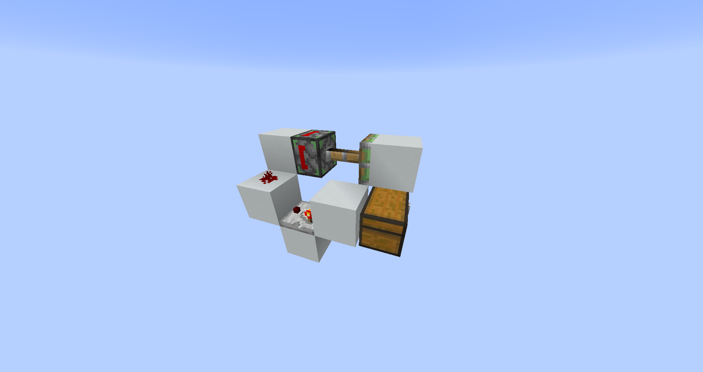
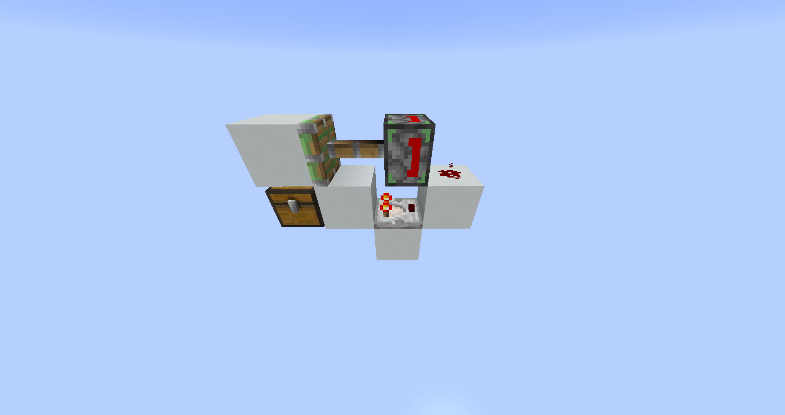
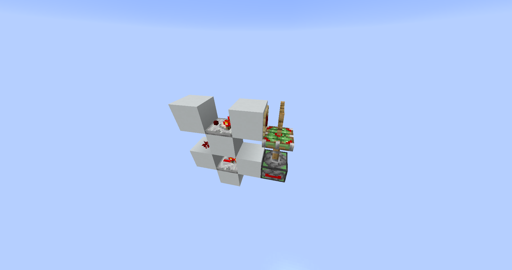
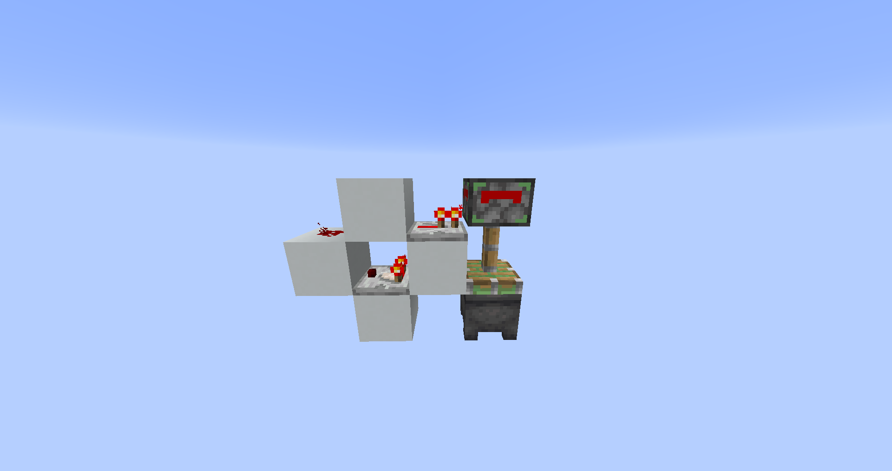
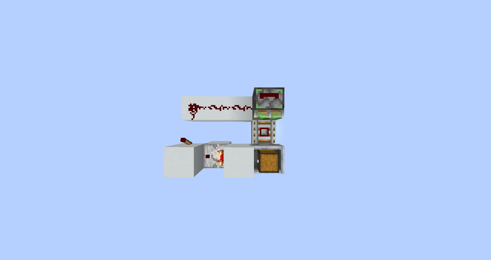
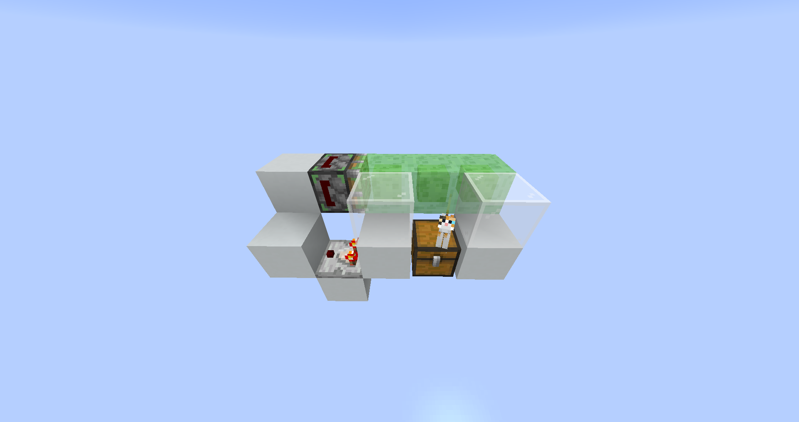
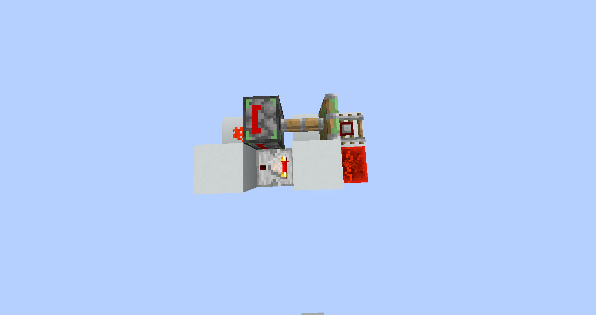
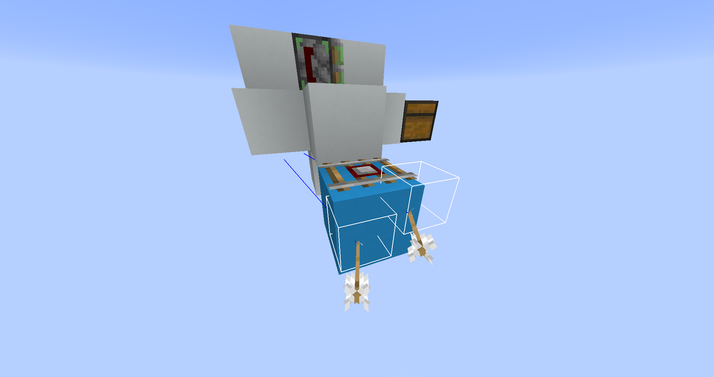
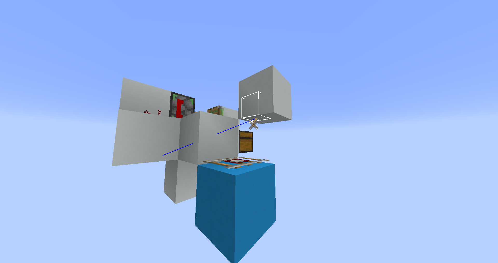
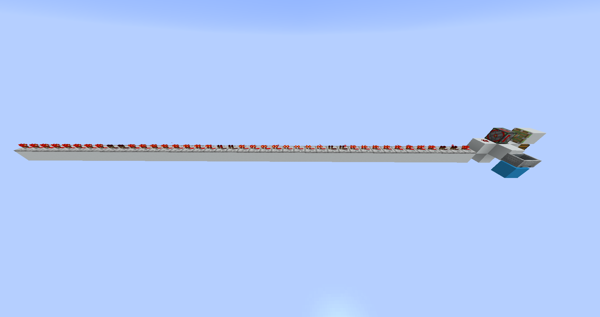

在基础红石原理中，我们将方块的亚稳态称为BUD态，能够更新处于BUD态的方块的信号称为方块更新信号，能够检测方块更新信号的装置称为BUD。但事实上，其他的一些装置如TEUD，观察者等似乎可以对其他信号做出相应，这意味着游戏存在更多类型的方块更新信号。对更多更新信号进行研究对启动更新理论进行了拓展。

基础的延迟理论旨在解释红石元器件和活塞的运行规律，但游戏中的红石元件显然不仅限于此。漏斗和观察者也是非常重要的红石元件，延迟理论的拓展将主要研究这两个元件。

<!-- TOC depthFrom:1 depthTo:6 withLinks:1 updateOnSave:1 orderedList:0 -->

- [第一节 TEUD](#第一节-teud)
	- [TEUD的简介](#teud的简介)
	- [TEUD的制作](#teud的制作)
	- [TEUD的功能](#teud的功能)
- [以下部分仅为原稿](#以下部分仅为原稿)
		- [TEUD的功能](#teud的功能)
	- [其他非常规BUD](#其他非常规bud)
		- [门BUD](#门bud)
		- [Y-BUD](#y-bud)
		- [CBUD](#cbud)
		- [观察者](#观察者)
	- [方块变化与更新信号的辩证关系](#方块变化与更新信号的辩证关系)
	- [即时更新理论对漏斗的修正](#即时更新理论对漏斗的修正)
	- [漏斗理论](#漏斗理论)
	- [观察者的延迟特性](#观察者的延迟特性)

<!-- /TOC -->

# 第一节 TEUD
## TEUD的简介

TEUD（Tile Entity Data Update Detector），又称DUD（Data Update Detector）或CUD（Comparator Update Detector），即比较器更新检测器，是一种BUD的拓展衍生物，其检测的不只是方块更新信号。

游戏需要检测方块是否处于正常的状态，因而有了方块更新信号，检测方块更新信号的检测器就是方块更新检测器。同样，比较器具有满箱检测的功能，其可以检测容器、炼药锅、物品展示框、末地传送门框架及探测铁轨上的矿车等诸多项目，可以预想到这些项目的检测依赖于另一种更新信号，也就是比较器更新信号，检测比较器更新信号的检测器就是比较器更新检测器了。TEUD的核心元件是比较器，因此TEUD比常规BUD有更广的检测范围。

最早已知且仍然稳定可用的一种TEUD实现是由NiceMarkMC给出的，时间不晚于2013年5月初。在此之前的若干研究与讨论都为TEUD的成型做出了铺垫。

比较器更新信号具有和方块更新信号不同的性质。最大的不同就是方块更新信号一般的更新范围是方块的毗邻，即使红石元件有较大的更新范围，这个更新范围也是由产生更新的方块主导的；比较器更新信号则允许更新信号沿四周的实体方块传递一格，如果不存在实体方块，比较器更新信号也就不会产生。这显然是因为比较器可以通过实体方块进行满箱检测。

## TEUD的制作

TEUD的核心是陷入BUD态的比较器，而TEUD必须实现自复位功能，这是TEUD的根本原理。让比较器陷入BUD态的方式多种多样，但大多数方案都使用了比较器检测戴尔功能。其中，箱基TEUD的制作最为简便。

箱子可以被红石比较器直接检测或隔着一个实体方块被红石比较器检测，当箱子内有物品且箱子没有被实体方块压住时，比较器才会输出信号。如果在内含物品的箱子上方拿实体方块压住箱子，比较器理论上讲应该会熄灭，但是由于这一行为往往无法更新到比较器，比较器就会陷入BUD态。这样一来，比较器就可以检测比较器更新信号了。用活塞控制实体方块压箱子可以将这一原理自动化。下图就是一个箱基TEUD。当更新比较器时，比较器熄灭，活塞收回，收回结束更新到比较器，比较器点亮，活塞伸出，压住箱子，TEUD复位。

若使得箱基TEUD的活塞不会更新到比较器，便可以制作出双稳态箱基TEUD，可以使用大箱子做到这一点。

物品展示框可以被比较器检测。物品展示框作为一个实体可以与其他碰撞不完整的方块共处一个方块内，但是此时比较器无法检测物品展示框，因此可以做出TEUD。 值得一提的是，这是一个双稳态TEUD。

炼药锅可以用于制作TEUD，其可以被比较器检测，但重点在于其可以被活塞移动，这就给出了一种极佳的自复位方法。

比较器可以检测探测铁轨上的矿车，而粘性活塞可以移动探测铁轨。这一过程主要是探测铁轨在产生比较器更新信号。

箱基TEUD也可以不使用实体方块而使用猫，猫会主动坐在箱子、床及燃烧的熔炉上，当猫坐在箱子上时，箱子无法被打开，比较器也无法进行检测。

利用红石指向BUD可以使一切输出元件陷入BUD态，比较器也不例外。

## TEUD的功能

在TEUD中，比较器陷入了BUD态，这意味着TEUD也能检测常规BUD所能检测的事项，为将比较器更新信号从方块更新信号中分离出来，我们可以利用比较器更新信号特殊的传递方式，隔着一个实体方块用特定事项更新比较器，这一过程称为TEUD的分离，隔着一个实体方块使TEUD动作的过程称为TEUD的响应。但红石元件往往具有较大的更新范围，即使隔着一个实体方块有时也无法成功分离方块更新信号和比较器更新信号，这种情况称为TEUD的分离失效。

除TEUD分离失效外，TEUD可以分离出许多比较器更新信号，从这一点来说，TEUD可以使纯红石系统的认知范围扩大。BUD现象的出现证实了游戏内存在方块更新信号，而TEUD则证实了游戏内存在着另一种更新信号——比较器更新信号。如果没有BUD和TEUD，这些更新信号像幽灵一样在游戏内运行而无法为人感知。因此是某些方块的变化，产生了特定的更新信号，这些更新信号由BUD或TEUD检测，才间接得知方块变化的发生，这是BUD和TEUD扩展纯红石系统的认知范围的原理。

TEUD主要检测容器及类容器的“内容物”发生变化。TEUD会响应箱子、熔炉、酿造台等容器的内容物信息变化。放置或破坏容器、直接取走或放入物品、通过漏斗取走或放入物品、投掷器或发射器投出物品、用其他物品替代已有物品甚至是在容器内左键或右键均会使TEUD响应。投掷器的空投、按住Shift左键或右键容器内部、打开和关闭容器、在容器内拖动左键或右键但不放开不会造成内容物的变化，TEUD不会响应。工作台、末影箱、花盆和音符盒不是容器，TEUD不会响应。

“类容器”是指类似容器的方块或实体，其没有类似箱子的GUI界面，但仍可以存储比较器可以检测的信息。其中如炼药锅、末地传送门框架等方块利用方块数据值存储信息，唱片机等方块使用方块实体值存储信息，物品展示框使用实体数据存储信息。探测铁轨可以“容纳”矿车，可以把探测铁轨也视为类容器，本小节会在最后对其进行研究。类容器方块会在被放置时产生比较器更新信号，破坏时不会产生；物品展示框在放置时不会产生比较器更新信号，破坏时会产生。

以下展示了常见的TEUD响应项：

- 将末影之眼放入末地传送门框架
- 将唱片插入唱片机或从中取出
- 炼药锅的水位变化
- 在讲台上放置或取下书籍、翻书

不过由于比较器本身就可以检测类容器的“内容物”变化，TEUD在这些项目的检测上并没有带来新的拓展。

TEUD和探测铁轨搭配时，会产生令人吃惊的效果：TEUD不再检测容器的内容物，转而成为一个实体检测器——当探测铁轨所在方块与某一实体碰撞箱有交集时，TEUD便会响应。因此，即使是浮空的实体也会触发TEUD。物品展示框、闪电不会使TEUD响应。如下图右侧的箭会触发TEUD，而左侧不会。

如下是一个角度刁钻的例子：

。

当实体与探测铁轨所在的方块接触时，实体会促使探测铁轨发出比较器更新信号，除箭外，这个信号是周期性的，但不同实体的周期不同：所有矿车的周期是20gt;物品为6gt；生物、钓鱼竿吊钩等大多数实体的周期为4gt；玩家的周期小于4gt，可以认为小于TEUD的自复位时间；箭只会在射到其上时产生1次比较器更新信号。~~（在这一方面似乎需要更多的研究。）~~

---

# 以下部分仅为原稿

---

### TEUD的功能

比起常规BUD，TEUD可以检测更多内容，主要是容器及类容器的“内容物”信息变化，如：
箱子、熔炉、酿造台、投掷器等内容物的物品变化，或左键及右键。这是TEUD最典型的检测内容。但是末影箱、工作台等并不能检测。注意：投掷器、发射器的空投也没有办法被检测。
将末影之眼放入末地传送门框架。
唱片机中唱片插入或取出。
炼药锅的水位变化。
音符盒的音高变化。
花盆中插入植物。
上述的部分项目是可以直接使用比较器来检测的，不过这与TEUD的检测原理截然不同。另一些项目如音符盒的音高变化则非TEUD不能检测。
TEUD甚至可以和探测铁轨搭配：将探测铁轨置于TEUD的比较器旁，探测铁轨便可以检测其上的实体并使TEUD响应，这是TEUD另一个让人吃惊的地方。更令人难以置信的是，TEUD产生的信号还会因实体的种类不同而有所不同，扔出的末影珍珠，射出的箭会产生脉冲，而生物、玩家、船、矿车、物品等则会输出时钟信号。这些实体产生的时钟信号从周期和占空比上看也有不同。从这一角度看，TEUD可能还有许多值得我们发掘的秘密，而至少现在，它可以用于大致地分辨处于探测铁轨上的实体的类别。

## 其他非常规BUD

TEUD是一种BUD，但不同于常规BUD，它检测的内容不止是方块更新，本质上与BUD“检测方块更新”这一概念不相符合，因此BUD这一词的概念应当有所扩大。现在我们认为，BUD是一种直接或间接检测方块变化的装置，检测方块更新信号的BUD称为常规BUD，其余称为非常规BUD。在一些资料中，常规BUD被直接简称为BUD，《基础红石原理》也是这样做的。而现在BUD一词已经拥有较多含义，为使读者不至混淆而产生歧义，本书之后不再做这种简称。
非常规BUD除TEUD外，还包含门BUD、Y-BUD、CBUD和观察者。

### 门BUD

门BUD与Y-BUD没有TEUD那么常用了，是属于较为冷门的BUD，也因此研究较少。它们很早以前就为人们所知，但是其中所蕴含的真正原理可能至今并未被人完全知晓。
这是一个门BUD，之所以称其为门BUD是因为其核心元件是门，门是一种很易陷入亚稳态的方块，而且一般的方块更新并不能使门BUD退出亚稳态，门BUD的检测范围小于常规BUD，只有红石元件造成的方块更新才能被门BUD所响应。这是门类方块所具有的特殊性质，且常常容易被玩家忽略。
木门与木栅栏门、木活版门可以用右键直接打开，但其同时是一个输出元件，如果因普通的方块更新就造成门因未激活而关闭，可能会带来很多不便，因此门被设计成只响应红石元件的更新，这可能是门BUD的形成原因。
通过上述解释，我们可以“手动使门陷入BUD态”，但这并不符合红石系统自动化的理念，鉴于门的特殊性，使用红石指向BUG制作门BUD非常简便。

### Y-BUD

Y-BUD是一种利用阳光传感器检测整个装置Y轴上是否有方块变化的BUD，其涉及到的原理可能是阳光传感器通过检测光照所带来的更新，以及36号方块对阳光传感器的影响。不过，这种BUD只能在白天使用。
这是一个Y-BUD的内部结构图，阳光传感器激活活塞，触发时红石线熄灭，活塞收回又伸出，BUD复位。
近一些的研究表明，Y-BUD由于检测光照，其检测项目会变得很复杂，这其中涉及到很多有关光照更新的内容，在Y-BUD上，人们还需要更多的研究。

### CBUD

CBUD(Collision Box Update Detector)是goohz发布的一种利用僵尸的寻路AI在方块变更时碰撞箱改变从而输出红石信号的装置，是一种新的BUD类型，所基于的原理也与普通的BUD大相径庭。这种BUD可以远距离检测某些特定位置上方块的变更，是“无线红石”信号传输技术的一种实现，检测的方式十分隐蔽。但这种BUD基于生物，抗干扰能力差，因此通用性没有常规BUD那么强。

### 观察者

在1.11中加入了“观察者”这个方块，这个方块据称可以用于检测方块更新信号。不过在实际的探究中，实验结论愈发偏向观察者检测的并非是方块更新信号，而是一种与方块更新类似的信号。对源码的研究证实了这样的想法，观察者直接检测某些方块的变化。一般来说，观察者的加入仅仅是游戏为提供了新的探测方式，提供了对世界的探知方式。
注意，观察者的检测方式并非是使自己陷入亚稳态而使用自己被更新来输出信号，因此观察者并非检测的是某种信号，而是单纯地检测检测端方块的变化，观察者可以检测某些方块变化。
观察者也是“去红石化”进程的重要方块之一。在某些场合下，使用观察者能比使用红石线或红石块达到更好的效果。值得一提的就是由红石线在激活与撤销激活时会带来大量的卡顿，观察者可以较好地缓解这一现象。此外观察者输出的是一个短脉冲，省去了短脉冲生成器的制作。
观察者是一个NTE输入元件，有一个检测端和一个输出端。输出端会主动连接红石信号，我们说观察者的指向是它的输出端。

## 方块变化与更新信号的辩证关系

面对常规BUD，我们可以说某些方块变化引起了方块更新信号，从而更新常规BUD，使其响应。也可以说常规BUD检测某些相对位置上特定的方块变化，这就是方块变化与更新信号的辩证关系。实践证明这种关系在研究观察者的检测时提供了很好的思维动力。
事实上，这种思想在输出元件的激活上也有体现，我们分别使用两种角度对待元件的激活：红石灯等较为简单地元件使用的是“红石线激活红石灯则亮起”的思路，而活塞等实则是“活塞激活位上有信号则推出”的思路。我们把这一点类比到方块更新理论中。从更新信号的角度看，是方块变化引起更新信号，不同的更新信号更新到不同类型的BUD，从而使其响应。从方块变化的角度，是不同类型的BUD检测特定的方块变化项，在属于这个特性方块变化项集合的某一个方块变化项发生时，该类型BUD响应。
那么，什么样的方块变化能够引起一类BUD的相应呢？很不幸，这两者之间没有绝对的关系，但是有一些规律可循。
一般说来，更新信号包括三类：最常规的由常规BUD检测的方块更新信号、由TEUD检测的比较器更新信号，以及可以被观察者响应的更新信号。这样说来，三种类型的BUD在所有的方块变化项构成的集合中圈定了三个子集，这些子集可以相互相交并产生交集，这样说来，可将所有的方块变化项分为互斥的八个子集。但是在这八个子集中，有一个集合为空集：能被常规BUD和TEUD响应，却不能被观察者响应的方块变化项不存在。这样的关系可以用Venn图表示如下。
流体方块在周围方块变化时会产生不可被常规BUD检测的变化，这种变化可以被观察者检测。这又是“装置发现幽灵”的一个典型事例。
通常来说，常规BUD、TEUD、以及观察者的检测范围都是不一样的，需要根据不同的需求采取不同的检测方式。而观察者也带来了超出方块更新体系的一面，观察者作为可移动的信号方式，并且有着奇特的激活方式。这样说来，观察者是1.11加入的新方块，其具有的特殊价值，以及新的利用方式还有待玩家积极开发，观察者有着非常大的应用前景。
举例来说，红石元器件所产生方块更新信号范围都较大因而产生BUD覆盖，例如红石线的强度变化，TEUD和常规BUD会有相同的响应。漏斗传输物品并不会产生方块更新，因此能被TEUD分离，而且漏斗内部的物品变更，本身就是一个方块变化，因此可以被观察者检测。投掷器的撤销激活不会产生任何方块更新或附加值更新信号，其内部的物品甚至没有变化，但是我们曾在投掷器的激活判定一节中提到：投掷器被激活后会变为激活的投掷器，撤销激活会变回。这显然是一个变化，可以用观察者检测。而中继器充能方块激活红石线的过程，实质上是中继器借助了实体方块而激活红石线，我们只把这种充能看做玩家对电路的分析方式，实体方块本身并没有什么变化，因此不会被观察者响应。

## 即时更新理论对漏斗的修正

即时更新理论近乎完美的解释了红石线、红石中继器、红石比较器、红石火把、活塞及粘性活塞甚至短脉冲的行为，不过，在研究漏斗时，需要得到修正。
漏斗是正式版1.5版本中加入的红石输出元件，其具有5格的存储空间。它的主要功能如下：
1.将其上1*1*1范围内的物品实体吸入自己的存储空间
2.漏斗可以从上方的容器中抽取物品。
3.漏斗可以将存储空间中的物品，传输至自己指向的容器中。漏斗的指向只能是下方或四周，因此只用漏斗是不可能将物品向上传递的。
4.当漏斗被激活时，失去以上功能。
漏斗被激活时可以发生变化，因此是一个输出元件。
能与漏斗进行互动的容器包括：
1.	箱子和陷阱箱，但不包括末影箱，漏斗能简单地从箱子中取出，或放入物品。
2.	发射器、投掷器、末影盒。
3.	箱子矿车、漏斗矿车。（尽管它们是实体而非方块）
4.	熔炉，在熔炉上方并指向熔炉的漏斗会将物品输入到待烧炼的物品格，在侧面并指向熔炉的漏斗会将物品输入到燃料的物品格，在熔炉下方的漏斗会将物品从成品的物品格中取出，不过，当使用岩浆桶作为燃料时，漏斗也可以将空桶取出。
5.	酿造台，漏斗可以向酿造台中输入水瓶、烈焰粉及酿造原料，同时也会将药水取出，不过值得注意的是只要输出栏中有药水，无论酿造是否完成，漏斗都会直接取出。
6.	其他漏斗，漏斗也可以将物品输入其他漏斗，或是从其他漏斗中将物品取出，两个漏斗可以同时进行自己的工作，相互独立。
我们可以使用即时更新理论，借助活塞刻逐步地研究漏斗的工作特性。
首先，当漏斗被激活时，漏斗会停止工作，可以设计实验探究当漏斗被撤销激活到漏下一个物品需要多长时间，为了尽量避免其他的干扰，观察漏斗的GUI与已知延迟对比即可得出以下结论。
漏斗在下降沿具有同步性，其不受输入方式的同步性影响，延迟恒为1pt，这个结论对大部分项目成立。同时，使用比较器检测漏斗的物品下降沿时，漏斗作为一个同步性输入方式。这意味着从信号撤销激活到比较器熄灭总计需要2pt。这2pt分为漏斗漏下的1pt，及比较器的1pt。
但是，对某些项目，漏斗的延迟似乎“消失”了，这意味着从信号下降沿到比较器熄灭只需要1pt，这1pt仅仅是比较器的1pt。这些项目大多与实体有关：掉落沙、爆炸、末影人拾起方块、苦力怕离开压力板等。这些项目在即时更新理论中是需要我们记忆的，但是如果考虑到更深层次的机制，就会发现这一现象正在启发我们使用更新顺序来解释。

## 漏斗理论

漏斗在Tile Entity事件工作，当漏斗被撤销激活时，会立即在下一个Tile Entity事件漏下一个物品，不过在时间轴顺序中，Tile Entity事件离活塞刻节点非常接近，因此大部分激活方式在更新到漏斗前都要先经过一个活塞刻节点，因此大部分激活方式都会使漏斗产生1pt的延迟。不过仍然有一小部分时间介乎于活塞刻节点与Tile Entity事件，例如：Entity Update事件。Entity Update事件提供信号下降沿时，按照更新顺序，漏斗会在下一个Tile Entity事件漏下物品，而没有跨过活塞刻节点，这就出现了我们上述实验中漏斗延迟消失的现象。
这是一个具有启示意义的结论，因为我们知道玩家的活动是在Network Update事件进行更新，而其他实体的更新是在Entity Update事件，因此，利用漏斗，便可以做到检测一个实体是否是玩家。
同样的事情也发生在上升沿，也就是说，只要漏斗被撤销激活，总会在下一个Tile Entity事件处理第一个物品，无论是取出、漏下、吸入物品。因此对于大部分输入方式，漏斗具有同步性，延迟为1pt，对少部分事件，漏斗没有延迟。而使用比较器检测漏斗时，无论是检测上升沿、下降沿，或是检测漏斗本身、上方的容器、指向的容器，信号都是同步的，比较器延迟恒为1pt，并输出一个在Next Tick Entry事件的非同步信号。
以上结论只适合于漏斗处理第一个物品时，当漏斗持续地工作时，延迟为8gt，即每秒2.5个物品。
事实是，漏斗和中继器等NTE元件有着类似的工作方式，漏斗有着8的冷却值倒计时，这和中继器有着2、4、6、8的冷却值倒计时类似。每游戏刻的Tile Entity事件，漏斗的冷却值倒计时都减少1，接着漏斗都要检查自己的冷却值倒计时，为0时尝试处理物品，并在处理成功时将冷却值倒计时重设为8，否则没有任何响应。
中继器只会在激活与撤销激活时使用它的冷却值倒计时，而漏斗无时不刻运行着它的倒计时，因此漏斗会带来卡顿是有道理的。
注意！当漏斗的冷却值倒计时为0，但漏斗没有物品可供处理时，漏斗不会将冷却值倒计时设为8而是保持在0，这意味着漏斗会在之后的每一个Tile Entity事件尝试处理物品，包括吸入、漏下、取出物品，其中吸入物品会带来较多的卡顿，并且这个吸入检测的频率由原先的8gt一次变为了1gt一次。熟练的玩家会在只用作传输而不用作收集的漏斗上方放置投掷器，投掷器作为完整碰撞的容器可以使漏斗的吸入功能停止，这样就大大减少了卡顿。早先，玩家们使用的是更为廉价的熔炉，但ilmango指出，熔炉自身会有对内容物熔炼的检测，这种检测也是每游戏刻进行一次，这又带来了不少的卡顿，而投掷器却没有这种效果。
很明显，这个新的理论是兼容漏斗被撤销激活时的行为的，因为漏斗冷却值倒计时为0时，自然是在下一个Tile Entity事件立即尝试处理物品。
漏斗还有一个奇怪的特性：当漏斗的冷却值倒计时小于等于1时，以非玩家方式放入物品时，漏斗的冷却值倒计时会被重置为8。这一特性已被实验证实。

## 观察者的延迟特性

观察者可以检测方块变化，这不仅在《基础红石原理》中有所提及，在非常规BUD一节中也有了详细叙述。而对于这个特殊的输入元件来说，玩家不仅考虑观察者能够检测怎样的变化，还考虑观察者在检测到信号后会产生怎样的信号，后者即被成为观察者的延迟特性。
观察者的输出端可以直接连接红石线，并给予其强迫指向，可以直接连接红石中继器或红石比较器，也可以作为比较器的侧向输入。如果观察者的输出端是一个实体方块，观察者被激活时可以强充能此方块。观察者激活时输出的信号强度为15。
观察者是一个0优先级的NTE元件。这意味着观察者的优先级红石火把相同。
观察者被激活时，产生的其实是一个2gt的短脉冲，我们用红石更新延迟理论介绍这个脉冲：
当观察者接收到变化时，观察者设置自己为不再响应任何方块变化，直到自身产生的2gt信号结束。这意味着观察者和红石中继器、红石比较器不同，高频信号并不会使得观察者常亮或常灭。观察者的响应具有1gt的延迟，这被称为观察者的启动延迟。观察者将会在变化来临后第二个Next Tick Entry事件给出2gt脉冲的上升沿，2gt后的Next Tick Entry事件给出脉冲的下降沿。
观察者还具有一个较为特殊的性质——观察者可以被活塞推动，那么如果观察者此时处于响应期，活塞的推动势必将破坏原有的启动延迟或脉冲，那么此时观察者会怎样动作呢？我们可以理解为观察者将活塞对自己的变化当做自己检测的对象，以此来产生2gt信号，具体说来：
活塞将观察者推动，首先要在Block Event事件将观察者变为36号方块，如果这个Block Event事件处于启动延迟当中，那么活塞的推动会使得原有的2gt脉冲无法产生。接着在活塞推出完成后，会在Tile Entity事件将36号方块恢复为观察者，启动延迟将继续，可以看作观察者将活塞推动结束的Tile Entity事件作为观察者的检测输入而重新进入启动延迟。
如果活塞推动观察者的Block Event事件处于2gt脉冲当中，那么活塞的推动会使得原有的2gt脉冲被打断，从而生成下降沿为Block Event事件的1gt脉冲甚至0gt脉冲。而在活塞推动完成后，观察者将直接被重置，不再产生信号。
如果是活塞瞬推，将观察者变为36号方块也在Block Event事件，将36号方块变回观察者也在Block Event事件，从而与普通的推动几乎无异。
[例]用红石更新延迟理论分析下述电路，并预测现象。

观察者产生的脉冲为2gt，而响应期则长于此，因此当观察者串成一串时，其也具有像红石线一样传递信号的功能。这种传递的优点在于信号会直接变为短脉冲，从而节省了短脉冲发生器的制作，同时，由于观察者的功能和信号产生原理，这种信号可以沿着观察者链朝各个方向传递，也可以“钻”过许多狭小的空间而不产生干扰，此外还可以产生和中继器一样的强充能和中继功能。观察者还可以和动力铁轨搭配使用，使得动力铁轨也可以传递红石信号。
当两个观察者面对面放置时，两个观察者会互相检测对方的变化，从而产生周期性信号，我们称之为观察者时钟。这种时钟由于体积小、便于操作和不适用红石线，受到了玩家们的喜爱。如果想增加这种时钟的周期，可以增加观察者的数量，并把它们绕成一个环形。控制关闭这种时钟的方式很简单——将其中一个观察者用粘性活塞抽走即可。
