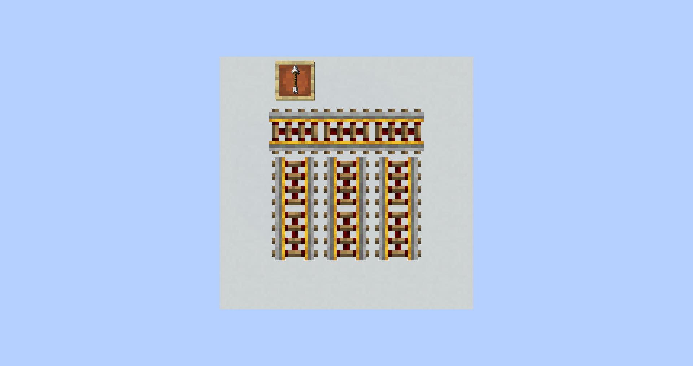

# 第一节 综述

矿车和铁轨最早在Infdev版本的秘密周五更新中作为Minecraft中不可缺少的“挖矿要素”而被加入，在其后的若干版本中得到完善，如同在秘密周五更新的Alpha版本中加入的动力矿车和箱子矿车（运输矿车）、Beta 1.5加入的动力铁轨（充能铁轨）和探测铁轨与1.5加入的漏斗矿车和激活铁轨。1.5加入的刷怪笼矿车、TNT矿车和1.7.2加入的命令方块矿车在本章中只作简要提及。

<!-- TOC depthFrom:1 depthTo:6 withLinks:1 updateOnSave:1 orderedList:0 -->

- [第一节 综述](#第一节-综述)
	- [铁轨简述](#铁轨简述)
	- [矿车运行的定性规律](#矿车运行的定性规律)
- [第二节 静态的铁轨分析](#第二节-静态的铁轨分析)
	- [铁路的东南法则](#铁路的东南法则)
	- [弯轨的分析](#弯轨的分析)
- [第三节 矿车动力学](#第三节-矿车动力学)
	- [无量纲约定](#无量纲约定)
	- [水平加速作用](#水平加速作用)
	- [单格动力铁轨加速实验](#单格动力铁轨加速实验)
	- [货运矿车单格最大滑行距离的推导](#货运矿车单格最大滑行距离的推导)
	- [多动力铁轨加速实验](#多动力铁轨加速实验)
	- [隐速度阈值](#隐速度阈值)
	- [多格加速模型](#多格加速模型)
		- [加速过程](#加速过程)
		- [加隐速度过程](#加隐速度过程)
		- [减隐速度过程](#减隐速度过程)
		- [减速过程](#减速过程)
		- [结论](#结论)
	- [货运矿车的阈值模型](#货运矿车的阈值模型)
	- [直轨加速阻尼模型总结](#直轨加速阻尼模型总结)
	- [制动铁轨](#制动铁轨)
	- [矿车回弹](#矿车回弹)

<!-- /TOC -->

## 铁轨简述

铁轨会因其所处的位置以及放置的顺序不同而有着不同的形状，具体来说，普通铁轨有着水平直轨，坡度直轨和水平弯轨三种形态；其他铁轨只有直轨的形态。铁轨的下方是其附着，附着被破坏是其也会被破坏，例外是坡度直轨拥有侧面附着，侧面附着被破坏时铁轨也会被破坏。

因此，想要用非普通铁轨直接转弯是不可能的，想要用普通铁轨同时转弯和上坡也是不可能的。如果让普通铁轨同时转弯和上坡，那么企图上坡的矿车会被卡入方块之中。

## 矿车运行的定性规律

由铁轨直接相连的系统被称为**铁路**。首先我们研究矿车从一条铁路驶出，又驶入另一条铁路时的运行方向具有怎样的规律。铁轨的形态有弯轨、平面直轨、坡度直轨三种，下面分别进行叙述。

矿车从一条铁路驶向另一条铁路的弯轨时，总会沿原先的运动方向前进。

矿车从一条铁路驶向另一条铁路的直轨时，总会朝东方或南方前进，这一点可以被归入东南法则。

矿车从一条铁路驶向另一条铁路的坡度直轨时，总会下坡前进。

了解如上的三条规律，可以更好的把握矿车在从一条铁路进入另一条铁路时的运行方向。如下的铁路充分利用的矿车驶入直轨和坡度轨时的规律，其研究是一个很有趣的课题——不使用弯轨如何使矿车可以双向地转弯。以下三张图分别给出了东—南、东—北和西—北转弯的一种设计。

与红石线类似地，矿车也有可能被“压线”，也就是被阻挡在坡度直轨上。但特殊的是，下图中的红色混凝土可以阻挡从上至下的矿车，黄绿色混凝土却无法阻挡。另外，只要矿车具有足够的速度，任何方块都无法阻挡从下向上运行的矿车。

一个基于此的有用的设计是存储矿车的自动队列，矿车被栅栏门阻挡，而前一存储单元的探测铁轨控制后裔存储单元的栅栏门。矿车从左侧入队并依次存储，而从右侧人为控制取出一只矿车时，所有矿车右移一个单元继续存储。

# 第二节 静态的铁轨分析

## 铁路的东南法则

在1.15之前，默认放置的单个铁轨总是南北朝向的，但在1.15之后，铁轨总是朝着玩家放置的方向。

铁轨的放置和连接有着与方向有关的优先规律，多个铁轨直接相连的系统可以被称为铁路。与此相关的规律可以被归入东南法则，在本节的若干图例中，如不特别说明，箭头总指向北方。

在1.15中，在已经成形的铁路两侧放置铁轨不会破坏原先的铁路，该铁轨的方向总会与直接放置单个铁轨时的朝向相同——也就是沿玩家的方向。如果新放置的铁轨在原铁路的末端，其首先尝试连接玩家方向的铁轨末端，如果这两个方向上没有铁轨，其尝试连接垂直玩家方向的铁路末端。如果将铁轨末端变为南北朝向不破坏任何已有的铁路结构，其可以将毗邻的铁路末端变为南北朝向；将铁轨末端变为东西朝向总会是成功的。总结而言，**铁轨总优先尝试按照玩家的方向放置，但铁路总优先保持东西朝向**。坡度直轨对这条规律没有影响。

*例 面朝北方，在橙色混凝土上放置动力铁轨，判断铁路的最终形状。如果面朝西方，再次判断。*

*铁轨总优先尝试按照玩家的方向放置，因此其与南北朝向的动力铁轨连接，被南北放置。面朝西方得到的结果是相同的。*

*例 面朝北方，依次在橙色混凝土和品红色混凝土上放置动力铁轨，判断铁路的最终形状。如果面朝西方，再次判断*

*面朝北方放置橙色铁轨时，南北方向没有铁轨末端，其只能东西连接，并将西侧铁轨变为东西向。当在放置品红色铁轨时，其会优先连接南侧橙色混凝土上的铁轨，故其南北放置。结果如下，其中箭指向北方。*

*面朝西方时，橙色铁轨因左下侧的铁轨而成为东西走向，但其不会改变左下侧铁轨的朝向。当放置品红色铁轨时，其尝试改变橙色铁轨的指向，使之成为东西朝向。结果如下，其中箭指向北方。*

*例 面朝北方，在橙色混凝土上放置动力铁轨，判断铁路的最终形状。如果面朝西方，再次判断。*

*必须注意，原铁路的末端仅有橙色铁轨的左侧和右侧，因此铁轨总会被左右放置，但只有南北朝向时能改变左右两侧铁轨朝向。结果如下，其中箭指向北方。*

*例 尝试在地面密铺3×3的东西朝向的铁轨。*

由于铁路总会优先保持东西走向，故只需要面朝西方或东方，沿东西方向铺设一条铁路，再铺设另外两条铁路即可。如果第二条铁路最先铺设在第一条铁路的末端，其会暂时变为南北指向，但第二条铁路的其他铁轨会纠正这一个错误。

*例 尝试在地面密铺3×3的南北朝向的铁轨，不允许在范围之外放置铁轨。*

*显然在铺设铁路时不能过于随意，不能在前一条铁轨的末端两侧铺设第二条铁轨，否则如果按照从上到下，从左到右的顺序铺设时会出现以下问题：*

*在铺设时应当先铺设铁轨的中间部分，再从中间部分延长至末端。*

铁轨被活塞推动，相当于在推动到位的位置直接放置原形态的铁轨，当多个铁轨被推动时，推动到位的次序自然应当用活塞推动方块次序的规律进行判断。

*例 面朝北方，分别拉下两个拉杆，判断铁路最终的形状。*

*当拉下上侧拉杆时，下侧铁轨先到位，保持南北放置。随后上侧铁轨到位，与下侧铁轨连接，结果如下。*

*当拉下上侧拉杆时，上侧铁轨先到位，优先东西连接。随后下侧铁轨到位，南北连接，但不能改变上侧铁轨的朝向。*

在1.15前，铁路保持东西走向比铁轨连接南北走向具有更高的优先级，换句话说，**铁路总优先形成东西朝向，在不能呈东西朝向时才会沿南北朝向**。

出于此，仅在3×3范围内操作就在其内密铺南北朝向的动力铁轨时不可能的，因为一旦放置一个铁轨末端，再在其毗邻放置的铁轨总会使其成为东西朝向。这种情况下可以用延长铁路，避免末端接触的方法密铺南北朝向的铁路。

## 弯轨的分析

普通铁轨的铺设与动力铁轨的铺设有着类似的规律，唯一的不同是普通铁轨具有弯轨这一特殊形态。当普通铁轨被放置时，如果其可以形成弯轨，其会优先形成弯轨，弯轨总会优先连接东侧和南侧。这一规律同样可以归入东南法则。

非常特殊的一点是，如果弯轨的三个方向有其他铁轨，红石信号可以控制弯轨的弯曲方向，弯轨未激活时优先连接东侧和南侧，弯轨激活时会优先连接西侧和北侧。但是如果弯轨的四个方向都有铁轨，红石信号对其没有作用。出于这一点，可以不把弯轨作为红石元件。

如果铁轨因放置或红石指向BUG处于不正常的状态（或称BUD态），这种状态只能由部分红石信号改变，如红石线直接指向、拉杆、观察者等(红石块会激活弯轨，但激活这一过程不会更新铁轨，暂不清楚这是否是一个BUG)，普通的方块更新不会使其回归正常的状态。

下面介绍连续弯轨和交叉弯轨，其本质上是多个弯轨的重复。下图左侧是一个朝前的偏向右侧的连续弯轨，每一个弯轨连接右侧和前侧，因此矿车可以从后向前运行，但从前方来的矿车会到达右侧而脱离铁轨。下图右侧是交叉弯轨，连接右侧和前侧的弯轨和连接前侧和左侧的弯轨交替出现，同样可以使后方来的矿车向前运行，但不能让矿车从前方向后运行。

布置一个连接前侧和右侧的弯轨，必须先在前侧和右侧放置铁轨，使其弯向前侧和右侧，随后再破坏多余辅助的铁轨，这就意味着弯轨连续弯轨或交叉弯轨只能向由后向前逐个铺设。同时，铺设新的弯轨时，旧的弯轨不能收到影响，这就意味着后方的弯轨处于西侧或北侧，因而，向东方和南方铺设连续弯轨或交叉弯轨只需要按部就班地逐个铺设即可。

铺设朝向北方或西方的连续弯轨或交叉弯轨需要辅以红石信号：在不放置铁轨的一侧放置红石信号源，保证新放置的弯轨处于激活态，连接前方而不是后方已铺设的弯轨。铺设完毕后，先去除多余辅助的铁轨，再去除红石信号源，保证弯轨不会因撤销信号而改变形态。

如果一条直轨铁路已经铺设完成了，如何将它们变为连续弯轨或交叉弯轨呢？在这种情况下，唯一能够变更弯轨的弯向，使之变为激活态或未激活态的方法是用红石信号更新它们。如下的装置可以将朝南或朝东的一列直轨变为连续弯轨。如果要铺设朝西和朝北的连续弯轨，可以在观察者前放置红石块，使其被更新为激活态。

交叉弯轨的制作稍为复杂，需要两个如上图的装置间隔运行，这就要求制作一个每两格触发一次的装置，在[粘液块及观察者技术](https://github.com/Xiaoyuan-xyz/The-Principle-of-Redstone-Circuits/blob/master/粘液块及观察者技术.md)中我们介绍了类似的装置。如下是ilmango给出的一种设计。

[^_^]:https://www.bilibili.com/video/av23620138

同样，如果需要朝西方或北方制作连续弯轨，需要在观察者前加红石块。

连续弯轨和交叉弯轨最早被应用于生存电路，用活塞在交叉弯轨上推动矿车，达到20m/s的速度。这种技术至少在2013年就得到了应用。

下面尝试铺设如下形状的铁路线。

难点在于弯轨。铺设下层的前右弯轨时，必须首先放置后侧和右侧的铁轨，因此本铁路应当从左向右铺设。如果面朝东方或南方，铺设下层的前右弯轨时，如果上层靠右弯轨已经铺设好了，其会主动连接前侧，也就是上层靠右弯轨，因此必须先铺设下层弯轨。但此时上层的靠右弯轨就没有机会弯向左侧和后侧了，除非使用一个浮空的方块加铁轨作为辅助。

如果是面朝南方或西方，该浮空方块的拆除需要推迟，至少要等下一单元的上层靠左弯轨铺设完毕，否则其会影响这一单元的靠右上层弯轨。

这种铁路的铺设方式并不唯一，例如玩家可以在下图的基础上继续修改，完成本铁路。

在1.15前，铁路的东西向连接具有很强的优先级，在东西方向铺设本铁路还是一件比较容易的事，只需要注意不断右移用来延长铁路以避免末端接触的辅助铁轨即可。但南北方向铺设该铁路难度较高，下面给出一种利用粘性活塞的方式。

首先按如下形式铺设铁路，再从左到右地依次激活并撤销激活粘性活塞。

上层铁轨被拉至下方，这一过程会使得两侧的普通铁轨弯向坡度动力铁轨。从左到右地拉动铁轨，就可以使普通铁轨统一弯向右侧了。

随后的铁路布局可以参考本节借用辅助方块的部分。

# 第三节 矿车动力学

矿车动力学是研究矿车在铁路之上运行规律的理论。研究表明，矿车在铁轨上的运行和一般实体的平面移动与落体运动并没有运行模式上的区别，但关键在于矿车的运动被铁轨局限于铁路之上，且矿车在每一游戏刻的运动主要取决于其下铁轨的状态。Octopuscraft的Mackler在2014年2月发布的《关于矿车系统的研究与应用》中对铁轨及矿车系统做了基础性的剖析，并给出了若干极具启发意义的实际应用与设计。nenn发布在RedstoneMachineryCommunication的一系列论文通过详实严谨的数据从实验角度阐明了矿车运行的规律，并给出基于理论分析的若干实际应用及实践方向。

本节内容将会通过若干实验构建出矿车在轨道上运行的定量规律，读者也可以同时参考上述的文献来辅助阅读。

## 无量纲约定

在进行实验前，我们首先做如下的无量纲约定。

在计算机实现中，矿车的位置和速度都由double型存储，其本身不具备量纲，并且在每游戏刻进行移动计算时，两者直接进行相加。实际应用中我们期望赋予物理量以量纲，但又希望在运算时忽略这一量纲，使得位置和速度可以直接相加。下面给出物理量的默认量纲，此后在本章的计算中，将忽略这些量纲的书写。

- 位移、距离、位置的单位：格（米），$\mathbb{b(m)}$。
- 时间单位：游戏刻，$\mathbb{gt}$。
- 速度单位：格（米）每游戏刻，$\mathbb{m/gt}$。
- 加速度单位：格（米）每二次游戏刻，$\mathbb{m/gt^2}$
- 信号强度，单位为1。
- 质量因子（下述），单位为1。
- 阻尼乘数、阻尼因子（下述），单位为1。

## 水平加速作用

首先我们介绍矿车实体如何存储自身的位置及速度。

矿车的实体数据中包含Pos和Motion两项，分别表示矿车的位置和速度，其x、y、z三个分量对应位置矢量和速度矢量的三个分量，其在计算机中使用double类型存储。

首先对动力铁轨的加速作用进行分析。必须注意到以下的一个事实：动力铁轨对普通矿车的加速存在上限，这个速度称为饱和速度。例如在如下的对比实验中，两辆矿车同时出发，其中一辆不断受到动力铁轨的加速，另一辆只接受4个动力铁轨的加速。事实是，在第二辆矿车离开动力铁轨的一段时间内，其和第一辆矿车保持同速。

换句话说，更多动力铁轨的加速不会使矿车获得更高的速度，但却可以使矿车移动更长的距离。

这两个实验说明，矿车存在一个**隐速度**，其表征矿车运动的快慢和能力，但矿车的真实速度却被限制在了饱和速度。

下面我们使用`\data get entity`指令获取对每一游戏刻矿车的Pos和Motion，实验内容为各类矿车在水平动力直轨上的运行情况。由于矿车在直轨上进行运动，这里只记录运动方向上的Pos和Motion。

<table align="center">
	<tr>
	    <th rowspan="2">游戏刻 \ 矿车类型</th>
	    <th colspan="2">非运矿车</th>
	    <th colspan="2">客运矿车</th>
			<th colspan="2">货运矿车（满载）</th>
			<th colspan="2">动力矿车（空载）</th>
	</tr >
	<tr >
	    <td>Pos</td>
			<td>Motion</td>
			<td>Pos</td>
			<td>Motion</td>
			<td>Pos</td>
			<td>Motion</td>
			<td>Pos</td>
			<td>Motion</td>
	</tr>
	<tr>
	    <td>0</td>
	    <td>0.5000</td>
			<td>0.0000</td>
			<td>0.5000</td>
			<td>0.0000</td>
			<td>0.5000</td>
			<td>0.0000</td>
			<td>0.5000</td>
			<td>0.0000</td>
	</tr>
	<tr>
	    <td>1</td>
	    <td>0.5000</td>
			<td>0.0200</td>
			<td>0.5000</td>
			<td>0.0200</td>
			<td>0.5000</td>
			<td>0.0200</td>
			<td>0.5000</td>
			<td>0.0200</td>
	</tr>
	<tr>
	    <td>2</td>
	    <td>0.5200</td>
			<td>0.0792</td>
			<td>0.5150</td>
			<td>0.0799</td>
			<td>0.5200</td>
			<td>0.0796</td>
			<td>0.5200</td>
			<td>0.0788</td>
	</tr>
	<tr>
			<td>3</td>
	    <td>0.5992</td>
			<td>0.1360</td>
			<td>0.5750</td>
			<td>0.1397</td>
			<td>0.5996</td>
			<td>0.1380</td>
			<td>0.5988</td>
			<td>0.1342</td>
	</tr>
	<tr>
			<td>4</td>
	    <td>0.7352</td>
			<td>0.1906</td>
			<td>0.6797</td>
			<td>0.1993</td>
			<td>0.7376</td>
			<td>0.1952</td>
			<td>0.7330</td>
			<td>0.1862</td>
	</tr>
	<tr>
	    <td>5</td>
	    <td>0.9258</td>
			<td>0.2430</td>
			<td>0.8292</td>
			<td>0.2587</td>
			<td>0.9328</td>
			<td>0.2513</td>
			<td>0.9192</td>
			<td>0.2352</td>
	</tr>
	<tr>
	    <td>6</td>
	    <td>1.1688</td>
			<td>0.2932</td>
			<td>1.0232</td>
			<td>0.3179</td>
			<td>1.1842</td>
			<td>0.3063</td>
			<td>1.1192</td>
			<td>0.2813</td>
	</tr>
	<tr>
	    <td>7</td>
	    <td>1.4620</td>
			<td>0.3415</td>
			<td>1.2616</td>
			<td>0.3769</td>
			<td>1.4905</td>
			<td>0.3602</td>
			<td>1.3192</td>
			<td>0.3246</td>
	</tr>
	<tr>
	    <td>8</td>
	    <td>1.8036</td>
			<td>0.3878</td>
			<td>1.5443</td>
			<td>0.4358</td>
			<td>1.8507</td>
			<td>0.4130</td>
			<td>1.5192</td>
			<td>0.3654</td>
	</tr>
	<tr>
	    <td>9</td>
	    <td>2.1914</td>
			<td>0.4323</td>
			<td>1.8712</td>
			<td>0.4945</td>
			<td>2.2507</td>
			<td>0.4647</td>
			<td>1.7192</td>
			<td>0.4038</td>
	</tr>
	<tr>
	    <td>10</td>
	    <td>2.5914</td>
			<td>0.4750</td>
			<td>2.2421</td>
			<td>0.5530</td>
			<td>2.6507</td>
			<td>0.5154</td>
			<td>1.9192</td>
			<td>0.4399</td>
	</tr>
	<tr>
	    <td>11</td>
	    <td>2.9914</td>
			<td>0.5160</td>
			<td>2.6421</td>
			<td>0.6114</td>
			<td>3.0507</td>
			<td>0.5651</td>
			<td>2.1192</td>
			<td>0.4738</td>
	</tr>
	<tr>
	    <td>12</td>
	    <td>3.3914</td>
			<td>0.5554</td>
			<td>3.0421</td>
			<td>0.6695</td>
			<td>3.4507</td>
			<td>0.6138</td>
			<td>2.3192</td>
			<td>0.5058</td>
	</tr>
</table>

- 矿车的位置用$r$来表示，第$t$游戏刻的位置用$r_t$来表示。由于矿车最初放置时都处于方块的中心，故$r_0=0.5$，在进行实验时我们总取$r_0=0.5$。
- 矿车的位移用$x$来表示，第$t$游戏刻的位置用$x_t$来表示，即$x_t=r_t-r_0$。
- 矿车的真实**速度**由相邻两游戏刻间的位移差来刻画，用$v$或来表示，第$t$和$t+1$游戏刻的位移差用$v_t$来表示，也就有$v_t=x_{t+1}-x_t$，也就是说本游戏刻的速度将会被加到下一游戏刻的位移上去。这是由于游戏先进行位置运算，随后才会进行阻尼和加速运算。
- 矿车的Motion似乎从某种程度上反映了矿车的真实速度，是一个与矿车速度有关的量，以下称为运动量或**隐速度**，这里用$M$表示Motion。
- 矿车在相邻两游戏刻间Motion的增量从某种程度上反映了矿车的加速度，是一个与矿车加速有关的量，以下称为加速度或加动量，这里用$a$表示，即$a_t=M_{t+1}-M_t$。

<table align="center">
	<tr>
	    <th rowspan="2">游戏刻 \ 矿车类型</th>
	    <th colspan="2">非运矿车</th>
	    <th colspan="2">客运矿车</th>
			<th colspan="2">货运矿车（满载）</th>
			<th colspan="2">动力矿车（空载）</th>
	</tr >
	<tr >
	    <td><i>v</i></td>
			<td><i>M</i></td>
			<td><i>v</i></td>
			<td><i>M</i></td>
			<td><i>v</i></td>
			<td><i>M</i></td>
			<td><i>v</i></td>
			<td><i>M</i></td>
	</tr>
	<tr>
	    <td>0</td>
	    <td>0.0000</td>
			<td>0.0000</td>
			<td>0.0000</td>
			<td>0.0000</td>
			<td>0.0000</td>
			<td>0.0000</td>
			<td>0.0000</td>
			<td>0.0000</td>
	</tr>
	<tr>
	    <td>1</td>
	    <td>0.0200</td>
			<td>0.0200</td>
			<td>0.1500</td>
			<td>0.0200</td>
			<td>0.0200</td>
			<td>0.0200</td>
			<td>0.0200</td>
			<td>0.0200</td>
	</tr>
	<tr>
	    <td>2</td>
	    <td>0.0792</td>
			<td>0.0792</td>
			<td>0.0600</td>
			<td>0.0799</td>
			<td>0.0796</td>
			<td>0.0796</td>
			<td>0.0788</td>
			<td>0.0788</td>
	</tr>
	<tr>
			<td>3</td>
	    <td>0.1360</td>
			<td>0.1360</td>
			<td>0.1047</td>
			<td>0.1397</td>
			<td>0.1380</td>
			<td>0.1380</td>
			<td>0.1342</td>
			<td>0.1342</td>
	</tr>
	<tr>
			<td>4</td>
	    <td>0.1906</td>
			<td>0.1906</td>
			<td>0.1495</td>
			<td>0.1993</td>
			<td>0.1952</td>
			<td>0.1952</td>
			<td>0.1862</td>
			<td>0.1862</td>
	</tr>
	<tr>
	    <td>5</td>
	    <td>0.2430</td>
			<td>0.2430</td>
			<td>0.1940</td>
			<td>0.2587</td>
			<td>0.2513</td>
			<td>0.2513</td>
			<td>0.2000</td>
			<td>0.2352</td>
	</tr>
	<tr>
	    <td>6</td>
	    <td>0.2932</td>
			<td>0.2932</td>
			<td>0.2384</td>
			<td>0.3179</td>
			<td>0.3063</td>
			<td>0.3063</td>
			<td>0.2000</td>
			<td>0.2813</td>
	</tr>
	<tr>
	    <td>7</td>
	    <td>0.3415</td>
			<td>0.3415</td>
			<td>0.2827</td>
			<td>0.3769</td>
			<td>0.3602</td>
			<td>0.3602</td>
			<td>0.2000</td>
			<td>0.3246</td>
	</tr>
	<tr>
	    <td>8</td>
	    <td>0.3878</td>
			<td>0.3878</td>
			<td>0.3269</td>
			<td>0.4358</td>
			<td>0.4000</td>
			<td>0.4130</td>
			<td>0.2000</td>
			<td>0.3654</td>
	</tr>
	<tr>
	    <td>9</td>
	    <td>0.4000</td>
			<td>0.4323</td>
			<td>0.3709</td>
			<td>0.4945</td>
			<td>0.4000</td>
			<td>0.4647</td>
			<td>0.2000</td>
			<td>0.4038</td>
	</tr>
	<tr>
	    <td>10</td>
	    <td>0.4000</td>
			<td>0.4750</td>
			<td>0.4000</td>
			<td>0.5530</td>
			<td>0.4000</td>
			<td>0.5154</td>
			<td>0.2000</td>
			<td>0.4399</td>
	</tr>
	<tr>
	    <td>11</td>
	    <td>0.4000</td>
			<td>0.5160</td>
			<td>0.4000</td>
			<td>0.6114</td>
			<td>0.4000</td>
			<td>0.5651</td>
			<td>0.2000</td>
			<td>0.4738</td>
	</tr>
	<tr>
	    <td>12</td>
	    <td></td>
			<td>0.5554</td>
			<td></td>
			<td>0.6695</td>
			<td></td>
			<td>0.6138</td>
			<td></td>
			<td>0.5058</td>
	</tr>
</table>

现在可以明显地看出：

- 矿车存在**饱和速度**$v_\mathbb{max}$，对动力矿车来说，这个值是0.2，对其他矿车来说，这个值是0.4。因而动力矿车在所有矿车中移动得最慢。
- 动力矿车在5游戏刻后达到速度饱和，此时动力矿车尚未离开第一格动力铁轨；其他矿车在第10游戏刻后均达到速度饱和，此时这些矿车均离开第一格动力铁轨，但均未离开第二格动力铁轨。
- 矿车达到饱和速度所用的时间称为饱和时间，期间驶过的位移称为饱和位移，分别用$t_v$和$x_v$表示。
- 对非运矿车、货运矿车和动力矿车来说，在达到饱和速度前，$v=M$，而客运矿车却有$v=0.75M$。这里我们把系数0.75称为**质量因子**，记作$m$。对客运矿车来说有$m=0.75$，对其他矿车来说有$m=1$，可以得出：

$$v=\mathbb{max}(v_\mathbb{max},mM)$$

- 在第一游戏刻，所有矿车的隐速度均为0.02，可以认为这是位于实体方块毗邻的矿车被动力铁轨给予的**初始隐速度**，即$M_1=0.02$。
- 矿车在第一游戏刻的加速度接近但略小于0.06，此后的加速度随速度增加而递减，可以认为动力铁轨中仍然存在阻尼作用，且有：

$$M_{t+1}=dM_t+a$$

这里$a=0.06$，表示动力铁轨的加速作用，$d$称为**阻尼乘数**，其试图用离散方式模拟与速度成正比的阻力加速度带来的减速效应。

以下针对不同的$d$，对$M$进行模拟，期望得出不同矿车的阻尼乘数。

<table align="center">
	<tr>
	    <th rowspan="3">游戏刻 \ 矿车类型</th>
	    <th colspan="2">非运矿车</th>
	    <th colspan="2">客运矿车</th>
			<th colspan="2">货运矿车（满载）</th>
			<th colspan="2">动力矿车（空载）</th>
	</tr >
	<tr >
	    <th colspan="2"><i>d</i>=0.96</th>
			<th colspan="2"><i>d</i>=0.997</th>
			<th colspan="2"><i>d</i>=0.98</th>
			<th colspan="2"><i>d</i>=0.9408</th>
	</tr>
	<tr >
	    <td>预测</td>
			<td>测量</td>
			<td>预测</td>
			<td>测量</td>
			<td>预测</td>
			<td>测量</td>
			<td>预测</td>
			<td>测量</td>
	</tr>
	<tr>
	    <td>1</td>
	    <td>0.0200</td>
			<td>0.0200</td>
			<td>0.0200</td>
			<td>0.0200</td>
			<td>0.0200</td>
			<td>0.0200</td>
			<td>0.0200</td>
			<td>0.0200</td>
	</tr>
	<tr>
	    <td>2</td>
	    <td>0.0792</td>
			<td>0.0792</td>
			<td>0.0799</td>
			<td>0.0799</td>
			<td>0.0796</td>
			<td>0.0796</td>
			<td>0.0788</td>
			<td>0.0788</td>
	</tr>
	<tr>
			<td>3</td>
	    <td>0.1360</td>
			<td>0.1360</td>
			<td>0.1397</td>
			<td>0.1397</td>
			<td>0.1380</td>
			<td>0.1380</td>
			<td>0.1342</td>
			<td>0.1342</td>
	</tr>
	<tr>
			<td>4</td>
	    <td>0.1906</td>
			<td>0.1906</td>
			<td>0.1993</td>
			<td>0.1993</td>
			<td>0.1952</td>
			<td>0.1952</td>
			<td>0.1862</td>
			<td>0.1862</td>
	</tr>
	<tr>
	    <td>5</td>
	    <td>0.2430</td>
			<td>0.2430</td>
			<td>0.2587</td>
			<td>0.2587</td>
			<td>0.2513</td>
			<td>0.2513</td>
			<td>0.2352</td>
			<td>0.2352</td>
	</tr>
	<tr>
	    <td>6</td>
	    <td>0.2932</td>
			<td>0.2932</td>
			<td>0.3179</td>
			<td>0.3179</td>
			<td>0.3063</td>
			<td>0.3063</td>
			<td>0.2813</td>
			<td>0.2813</td>
	</tr>
	<tr>
	    <td>7</td>
	    <td>0.3415</td>
			<td>0.3415</td>
			<td>0.2827</td>
			<td>0.3769</td>
			<td>0.3602</td>
			<td>0.3602</td>
			<td>0.2000</td>
			<td>0.3246</td>
	</tr>
	<tr>
	    <td>8</td>
	    <td>0.3878</td>
			<td>0.3878</td>
			<td>0.4358</td>
			<td>0.4358</td>
			<td>0.4130</td>
			<td>0.4130</td>
			<td>0.3654</td>
			<td>0.3654</td>
	</tr>
	<tr>
	    <td>9</td>
	    <td>0.4323</td>
			<td>0.4323</td>
			<td>0.4945</td>
			<td>0.4945</td>
			<td>0.4647</td>
			<td>0.4647</td>
			<td>0.4038</td>
			<td>0.4038</td>
	</tr>
	<tr>
	    <td>10</td>
	    <td>0.4750</td>
			<td>0.4750</td>
			<td>0.5530</td>
			<td>0.5530</td>
			<td>0.5154</td>
			<td>0.5154</td>
			<td>0.4399</td>
			<td>0.4399</td>
	</tr>
	<tr>
	    <td>11</td>
	    <td>0.5160</td>
			<td>0.5160</td>
			<td>0.6114</td>
			<td>0.6114</td>
			<td>0.5651</td>
			<td>0.5651</td>
			<td>0.4738</td>
			<td>0.4738</td>
	</tr>
	<tr>
	    <td>12</td>
	    <td>0.5554</td>
			<td>0.5554</td>
			<td>0.6695</td>
			<td>0.6695</td>
			<td>0.6138</td>
			<td>0.6138</td>
			<td>0.5058</td>
			<td>0.5058</td>
	</tr>
</table>

预测结果与实际值高度吻合，且阻尼乘数仅与矿车类型有关，与铁轨类型无关。对动力矿车，有$0.9408=0.98\times 0.96$。

以此预期，矿车的隐速度也会存在饱和现象，即在足够长（大于400格）的动力铁轨加速下，可以认为动力铁轨的加速作用和动力铁轨的阻尼减速作用带来的结果相同。此时称这个速度为**饱和隐速度**或**终端速度**，或称为饱和运动量，记为$M_\mathbb{max}$。应当有$M_\mathbb{max}=dM_\mathbb{max}+a$，即

$$M_\mathbb{max}=\dfrac{a}{1-d}=\dfrac{a}{k}$$

其中$k$称为**阻尼因子**，有$k=1-d$。

因而各类型矿车的终端速度有非运矿车$M_\mathbb{max}=1.5$，客运矿车$M_\mathbb{max}=20$，满载货运矿车$M_\mathbb{max}=3$，动力矿车$M_\mathbb{max}=\dfrac{75}{74}$。这是理论上矿车在铁轨上所能获得的最大隐速度，实际上矿车隐速度还受隐速度阈值的限制。

## 单格动力铁轨加速实验

为了研究动力铁轨如何对矿车进行加速，玩家们首先设计了如下的对照实验：只使用1格动力铁轨作为加速，记录不同矿车在阻尼直轨上的最远运行距离（下称最大滑行距离$S_\mathbb{max}$）。这里**阻尼直轨**指的是普通铁轨、探测铁轨或激活铁轨，因为实验证明矿车在这三种铁轨上的减速过程完全相同，而后会证明，动力铁轨虽然有加速效果，但其本身的阻尼效果与阻尼直轨的效果相同。

在初步实验中，我们首先指出：

- 漏斗矿车、箱子矿车的最大滑行距离取决于矿车容器的信号强度，我们称这种矿车为货运矿车。所容物信号强度越大，矿车的最大滑行距离越小，以下记货运矿车的信号强度为$h$。
- 空矿车、TNT矿车、命令方块矿车、刷怪笼矿车具有相同的运动规律，以下统称非运矿车，在矿车运动学中的“普通矿车”也可能代指非运矿车。
- 矿车被玩家放置时，其位置位于方块的正中心，x和z坐标西北下顶点多0.5，y坐标比其下方块高0.0625，也就是1/16，可以认为该高度是铁轨的厚度。因此，单格动力铁轨对矿车的加速实际上只有0.5格。
- 在单格动力铁轨加速中，除动力矿车外，其他矿车均未到达饱和速度。饱和速度指的是游戏为每类矿车设定的最大速度值，动力矿车的饱和速度是0.2m/gt（=4m/s），其他矿车的饱和速度是0.4m/gt（=8m/s）。
- 空矿车在承载乘客后，最大滑行距离变长，此时我们称这种矿车为客运矿车。

在1.13.2版本中，搭建如下的实验装置，左侧的漏斗矿车或箱子矿车分别装载信号强度为0-15的物品，其下为单格动力铁轨。

~~在1.14的某次未知的更新后，矿车似乎在速度小于0.0003时不会移动，导致矿车相较于旧版本的最大滑行距离少约0.07格，在这方面似乎需要更多的研究。以下实验基于1.13.2，目前认为其在一个很广的版本范围内适用，至少包含1.12。~~

经过足够长的时间（>3000gt），可以认为所有矿车静止，从而测出矿车的最大滑行距离。

以下为实验结果，误差不超过0.001格

| 信号强度 | 最大滑行距离 |
| -------- | ------------ |
| 0        | 64.000       |
| 1        | 53.333       |
| 2        | 46.714       |
| 3        | 40.000       |
| 4        | 35.556       |
| 5        | 32.000       |
| 6        | 29.091       |
| 7        | 26.667       |
| 8        | 24.615       |
| 9        | 22.857       |
| 10       | 21.333       |
| 11       | 20.000       |
| 12       | 18.824       |
| 13       | 17.778       |
| 14       | 16.842       |
| 15       | 16.000       |

可以观察到，货运矿车的最大滑行距离与信号强度有着明显的反比例关系，换言之

$$S_\mathbb{max}=\dfrac{320}{h+5}$$

按照这个公式推算，若货运矿车的信号强度小于-5，矿车便可在阻尼直轨上永远运行下去。笔者特意回到1.7.2版本，使用负数物品BUG制作出信号强度为-5的漏斗矿车，证实了这一合理外推。

以下为其他矿车类型的实验数据：

| 矿车类型         | 最大滑行距离 |
| ---------------- | ------------ |
| 非运矿车         | 8.000        |
| 货运矿车（满载） | 16.000       |
| 货运矿车（空载） | 64.000       |
| 客运矿车         | 80.000       |

仅从数据来看，非运矿车可以看作信号强度为35的货运矿车，客运矿车似乎可以看作信号强度为-1的货运矿车。

## 货运矿车单格最大滑行距离的推导

运用上一小节的方法，我们可以得出货运矿车阻尼乘数与信号强度的关系，即
$$d=0.995-0.001h$$
或
$$k=0.001(h+5)$$
相应地有
$$M_\mathbb{max}=\dfrac{60}{h+5}$$

下面我们来推导在单格动力铁轨加速时的最大滑行距离，由前可知，货运矿车无法在单格动力铁轨上达到饱和速度，在第6游戏刻后，其脱离动力铁轨。又对货运矿车，质量因子$m=1$，在全过程中都有$v_t=M_t$。

对加速过程，改写加速公式为

$$M_{t+1}-M_\mathbb{max}=d(M_t-M_\mathbb{max})$$

因而$v_6=M_6=d^5(M_1-M_\mathbb{max})+M_\mathbb{max}$，为全过程的最大速度。

$$x_6=\sum_{t=1}^{5}v_t=\sum_{t=1}^{5}M_t=(M_1-M_\mathbb{max})\dfrac{1-d^5}{1-d}+5M_\mathbb{max}$$

驶出动力铁轨后，有$M_{t+1}=dM_t$，故$v_t=d^{t-6}v_6$。

由以上分析，便可推导出货运矿车的最大滑行距离

$$
\begin{align}
S_\mathbb{max}
&=\lim\limits_{n\rightarrow\infty}x_n
=\sum_{t=6}^{\infty}v_t+x_6\\
&=\dfrac{(M_1-M_\mathbb{max})d^5+M_\mathbb{max}}{1-d}
+(M_1-M_\mathbb{max})\dfrac{1-d^5}{1-d}+5M_\mathbb{max}\\
&=\dfrac{(M_1-M_\mathbb{max})d^5+M_\mathbb{max}+(M_1-M_\mathbb{max})(1-d^5)}{1-d}+5M_\mathbb{max}\\
&=\dfrac{M_1}{k}+5M_\mathbb{max}\\
&=\dfrac{20}{p+5}+5\dfrac{60}{p+5}\\
&=\dfrac{320}{p+5}\end{align}
$$

这就证明了货运矿车在单格动力铁轨加速下的反比例关系。

## 多动力铁轨加速实验

在理想情况下，矿车经足够长动力铁轨加速后到达终端速度。脱离动力铁轨进入阻尼直轨，隐速度全部转化为位移。下面尝试给出不同矿车经若干动力铁轨加速后进入阻尼直轨的最大滑行距离。

<table align="center">
	<tr>
	    <th rowspan="2">动力铁轨数量 \ 矿车类型</th>
	    <th colspan="3">最大滑行距离（已减去0.5）</th>
	</tr >
	<tr >
	    <th>动力矿车</th>
			<th>非运矿车</th>
			<th>货运矿车（空载）</th>
	</tr>
	<tr>
	    <td>1</td>
	    <td>5.113</td>
			<td>8.000</td>
			<td>64.000</td>
	</tr>
<tr>
<td>2</td>
<td>6.824</td>
<td>11.453</td>
<td>97.128</td>
 </tr>
 <tr>
<td>3</td>
<td>7.681</td>
<td>14.107</td>
<td>113.698</td>
 </tr>
 <tr>
<td>4</td>
<td>8.197</td>
<td>15.133</td>
<td>133.645</td>
 </tr>
 <tr>
<td>5</td>
<td>8.529</td>
<td>16.782</td>
<td>144.204</td>
 </tr>
 <tr>
<td>6</td>
<td>8.755</td>
<td>17.361</td>
<td>158.072</td>
 </tr>
 <tr>
<td>7</td>
<td>8.911</td>
<td>18.527</td>
<td>165.741</td>
 </tr>
 <tr>
<td>8</td>
<td>9.023</td>
<td>18.864</td>
<td>176.335</td>
 </tr>
 <tr>
<td>9</td>
<td>9.102</td>
<td>19.750</td>
<td>182.305</td>
 </tr>
 <tr>
<td>10</td>
<td>9.160</td>
<td>19.940</td>
<td>190.850</td>
 </tr>
 <tr>
<td>11</td>
<td>9.202</td>
<td>20.645</td>
<td>195.703</td>
 </tr>
 <tr>
<td>12</td>
<td>9.232</td>
<td>20.738</td>
<td>202.845</td>
 </tr>
 <tr>
<td>13</td>
<td>9.254</td>
<td>21.320</td>
<td>206.907</td>
 </tr>
 <tr>
<td>14</td>
<td>9.270</td>
<td>21.342</td>
<td>209.220</td>
 </tr>
 <tr>
<td>15</td>
<td>9.282</td>
<td>21.836</td>
<td>209.020</td>
 </tr>
 <tr>
<td>16</td>
<td>9.290</td>
<td>21.809</td>
<td>209.220</td>
 </tr>
 <tr>
<td>17</td>
<td>9.297</td>
<td>22.238</td>
<td>209.020</td>
 </tr>
 <tr>
<td>18</td>
<td>9.301</td>
<td>22.174</td>
<td>209.220</td>
 </tr>
 <tr>
<td>19</td>
<td>9.305</td>
<td>22.555</td>
<td>209.020</td>
 </tr>
 <tr>
<td>20</td>
<td>9.308</td>
<td>22.462</td>
<td>209.220</td>
 </tr>
 <tr>
<td>21</td>
<td>9.309</td>
<td>22.806</td>
<td>209.020</td>
 </tr>
 <tr>
<td>22</td>
<td>9.311</td>
<td>22.692</td>
<td>209.220</td>
 </tr>
 <tr>
<td>23</td>
<td>9.312</td>
<td>23.005</td>
<td>209.020</td>
 </tr>
 <tr>
<td>24</td>
<td>9.313</td>
<td>22.873</td>
<td>209.220</td>
 </tr>
 <tr>
<td>25</td>
<td>9.313</td>
<td>23.165</td>
<td>209.020</td>
 </tr>
 <tr>
<td>26</td>
<td>9.314</td>
<td>23.020</td>
<td>209.220</td>
 </tr>
 <tr>
<td>27</td>
<td>9.314</td>
<td>23.295</td>
<td>209.020</td>
 </tr>
 <tr>
<td>28</td>
<td>9.314</td>
<td>23.138</td>
<td>209.220</td>
 </tr>
 <tr>
<td>29</td>
<td>9.314</td>
<td>23.397</td>
<td>209.020</td>
 </tr>
 <tr>
<td>30</td>
<td>9.314</td>
<td>23.232</td>
<td>209.220</td>
 </tr>
 <tr>
<td>31</td>
<td>9.315</td>
<td>23.480</td>
<td>209.020</td>
 </tr>
 <tr>
<td>32</td>
<td>9.315</td>
<td>23.309</td>
<td>209.220</td>
 </tr>
</table>

从数据中可以发现一个有趣的事实，虽然从整体上所有矿车都随动力铁轨数增加而增加，但除动力矿车外，其他矿车存在奇偶效应。当加速铁轨的数量足够多时，矿车的最大滑行距离出现微小的“抖动”。

此外空载货运矿车似乎在14格动力铁轨时，最大滑行距离突然停止增加，尽管奇偶效应仍然存在，但奇数组和偶数组的最大滑行距离严格相等，这暗示我们游戏似乎存在另一种“速度上限”，以下称这种速度上限为动量阈值或隐速度阈值。

## 隐速度阈值

隐速度阈值是游戏对于矿车隐速度所做的强制性隐速度限制，其在矿车运动前将超过2的隐速度强制变为2。但由于矿车实际的隐速度运算和位移运算之后，矿车的在动力直轨上的隐速度阈值将稍大于2，具体而言有
$$M_\mathrm{TH}=dM_\mathrm{th}+a$$
其中$M_\mathrm{TH}$ 为隐速度阈值，$M_\mathrm{th}=2$。

虽然隐速度阈值客观存在，并且可以通过测量矿车在足够长（>20格）的动力铁轨加速后的隐速度得到，但由于隐速度的加速和阻尼运算位于隐速度阈值变为2这一强制操作之后，当矿车离开动力铁轨的下一游戏刻，隐速度的值为$M=dM_\mathrm{th}$，而不是$M=dM_\mathrm{TH}$。换句话说，隐速度阈值$M_\mathrm{TH}$ 只有显示意义，而没有计算意义。

可以看出，阻尼乘数越大，达到隐速度阈值越快，需要的动力铁轨数越少。非运矿车和动力矿车的终端速度小于2，这两种矿车不可能通过动力铁轨加速达到隐速度阈值，故只考虑客运矿车和货运矿车的隐速度阈值。

对于货运矿车而言，$d=0.995-0.001h$，因此
$$M_\mathrm{TH}=dM_\mathrm{th}+a=2(0.995-0.001h)+0.06=2.05-\dfrac{h}{500}$$

隐速度阈值和终端速度是两个不同的概念，前者是游戏的强制设定，后者则是加速效果和阻尼效果达到平衡的一种体现。达到隐速度阈值通常只需要十几个动力铁轨，并且此后的隐速度将会被严格限制在隐速度阈值；而严格来讲终端速度只能无限接近而不能达到，一般而言需要几十甚至几百格动力铁轨的加速才可以认为当前隐速度与终端速度足够接近。

## 多格加速模型

下面假设动力铁轨的数量未能使矿车达到隐速度阈值，再将整个多格动力铁轨加速阻尼的全过程分为加速过程、加隐速度过程、减隐速度过程和减速过程四个过程。

### 加速过程

在加速过程$0\le t<t_A$中，矿车处于动力铁轨之上，尚未达到饱和速度。也就是$v_t=mM_t=m(d^{t-1}(M_1-M_\mathbb{max})+M_\mathbb{max})<v_\mathbb{max}$。对非运矿车来说$t<9$，客运矿车$t<10$，货运矿车$t<8$，动力矿车$t<5$。具体情况如下表：

| --               | 非运矿车 | 客运矿车 | 货运矿车（空载） | 货运矿车（满载） | 动力矿车         |
| ---------------- | -------- | -------- | ---------------- | ---------------- | ---------------- |
| $d$              | 0.96     | 0.997    | 0.995            | 0.98             | 0.9408           |
| $m$              | 1        | 0.75     | 1                | 1                | 1                |
| $v_\mathbb{max}$ | 0.4      | 0.4      | 0.4              | 0.4              | 0.2              |
| $M_\mathbb{max}$ | 1.5      | 20       | 12               | 3                | $\dfrac{75}{74}$ |
| $t_A$            | 9        | 10       | 8                | 8                | 5                |
| $M_{t_A}$        | 0.4323   | 0.5530   | 0.4330           | 0.4130           | 0.2352           |
| $x_{t_A}$        | 1.6914   | 1.7421   | 1.3875           | 1.3507           | 0.4192           |

可以预想到，在接下来的两个匀速过程中，非运矿车的位移将会形如1.6914，2.0914，2.4914，2.8914，3.2914，3.6914...其中1.6914，2.0914和2.4914位于奇数格铁轨之上，2.8914和3.2914位于偶数格铁轨之上。非运矿车在奇数格铁轨停留3游戏刻，进行3次加速，在偶数格铁轨上停留2游戏刻，进行2次加速。除了货运矿车，其他矿车都有这样的现象，这就是奇偶效应产生的根源。动力矿车每游戏刻进行5次加速，没有奇偶之分。

### 加隐速度过程

在加隐速度过程$t_A\le t<t_B$中，矿车仍然处于动力铁轨之上，但已到达饱和速度，此时矿车仅增加隐速度。由于铁轨总是整格的，假设在这一过程中矿车经过了$n$格动力铁轨，那么动力矿车会花费 $\Delta t=5n$的时间，而其他矿车因为存在奇偶效应，需要花费的时间为
$\Delta t=\left\{
             \begin{array}{**ll**}
             5k+3, & n=2k+1,k\in\mathbb N\\
             5k,& n=2k,k\in\mathbb N\\
             \end{array}
\right.$

因此，如果总计有$n$个动力铁轨 $(n\ge2)$，我们就可以计算不同矿车结束匀速加动量过程后的状态。

$$M_{t_B}=(M_1-M_\mathbb{max})d^{t_B-1}+M_\mathbb{max}$$
$$x_{t_B}=mv_\mathbb{max}(t_B-t_A)+x_{t_A}$$

其中 $x_{t_B}$ 是一个略大于$n-0.5$的数（因为其恰刚离开第$n$格铁轨），这里统一将其写为$x_{t_B}=n-(1-\sigma)$ 的形式， $\sigma$称为**位移偏置常量**，仅与矿车类型与动力铁轨奇偶性有关。具体有 $\sigma=x-\lfloor x\rfloor$，$x$在这里指离开动力铁轨时的位移，特别地，$\sigma=x_{t_A}-\lfloor x_{t_A}\rfloor$。

具体而言有

非运矿车
$$t_B=\left\{
             \begin{array}{**ll**}
             5k+7, & n=2k+1,k\in\mathbb N\\
             5k+4,& n=2k,k\in\mathbb N\\
             \end{array}
\right.$$
$$M_{t_B}=\left\{
             \begin{array}{**ll**}
             (0.02-1.5)0.98^{5k+6}+1.5, & n=2k+1,k\in\mathbb N\\
             (0.02-1.5)0.98^{5k+3}+1.5,& n=2k,k\in\mathbb N\\
             \end{array}
\right.$$
$$x_{t_B}=\left\{
             \begin{array}{**ll**}
             n-0.1086, & n=2k+1,k\in\mathbb N\\
             n-0.3086,& n=2k,k\in\mathbb N\\
             \end{array}
\right.$$

客运矿车
$$t_B=\left\{
             \begin{array}{**ll**}
             5k+7, & n=2k+1,k\in\mathbb N\\
             5k+5,& n=2k,k\in\mathbb N\\
             \end{array}
\right.$$
$$M_{t_B}=\left\{
             \begin{array}{**ll**}
             (0.02-20)0.997^{5k+6}+20, & n=2k+1,k\in\mathbb N\\
             (0.02-20)0.997^{5k+4}+20,& n=2k,k\in\mathbb N\\
             \end{array}
\right.$$
$$x_{t_B}=\left\{
             \begin{array}{**ll**}
             n-0.0579, & n=2k+1,k\in\mathbb N\\
             n-0.2579,& n=2k,k\in\mathbb N\\
             \end{array}
\right.$$

货运矿车（空载）
$$t_B=\left\{
             \begin{array}{**ll**}
             5k+6, & n=2k+1,k\in\mathbb N\\
             5k+4,& n=2k,k\in\mathbb N\\
             \end{array}
\right.$$
$$M_{t_B}=\left\{
             \begin{array}{**ll**}
             (0.02-12)0.995^{5k+5}+12, & n=2k+1,k\in\mathbb N\\
             (0.02-12)0.995^{5k+3}+12,& n=2k,k\in\mathbb N\\
             \end{array}
\right.$$
$$x_{t_B}=\left\{
             \begin{array}{**ll**}
             n-0.4125, & n=2k+1,k\in\mathbb N\\
             n-0.2125,& n=2k,k\in\mathbb N\\
             \end{array}
\right.$$

货运矿车（满载）
$$t_B=\left\{
             \begin{array}{**ll**}
             5k+6, & n=2k+1,k\in\mathbb N\\
             5k+4,& n=2k,k\in\mathbb N\\
             \end{array}
\right.$$
$$M_{t_B}=\left\{
             \begin{array}{**ll**}
             (0.02-3)0.98^{5k+5}+3, & n=2k+1,k\in\mathbb N\\
             (0.02-3)0.98^{5k+3}+3,& n=2k,k\in\mathbb N\\
             \end{array}
\right.$$
$$x_{t_B}=\left\{
             \begin{array}{**ll**}
             n-0.0493, & n=2k+1,k\in\mathbb N\\
             n-0.2493,& n=2k,k\in\mathbb N\\
             \end{array}
\right.$$

动力矿车
$$t_B=5n+1$$
$$M_{t_B}=(0.02-\dfrac{75}{74})0.9408^{5n}+\dfrac{75}{74}$$
$$x_{t_B}=n-0.3808$$

### 减隐速度过程

在减隐速度过程$t_B\le t<t_C$中，矿车进入阻尼直轨，此时加速效果消失，但因矿车隐速度较大，其保持匀速，也就有$mM>v_\mathbb{max}$。

当匀速减动量过程结束的标志是$mM_{t_C}<v_\mathbb{max}$，设该过程经历的时间为 $\Delta t$，有$M_{t_c}=d^{\Delta t}M_{t_b}$，据此可以解出该过程所需的时间。
$$\Delta t=\lceil\log_d\dfrac{v_\mathbb{max}}{mM_{t_B}}\rceil$$
在这一过程中，矿车保持匀速，故结束时有
$$x_{t_C}=x_{t_B}+v_\mathbb{max}\Delta t=x_{t_B}+v_\mathbb{max}\lceil \log_d\dfrac{v_\mathbb{max}}{mM_{t_B}}\rceil$$

### 减速过程

减速过程$t_C\le t<+\infty$是最后一个过程，随着矿车的隐速度不断下降，矿车将以$v_{t_C}$ 为初速做阻尼减速运动，这种运动在之前已经进行过讨论。

### 结论

经过如上四个阶段的讨论，我们可以得出结论
$$\begin{align}
S_\mathbb{max}&=x_\infty-(n-1)=x_{t_C}+\dfrac{v_{t_C}}{1-d}-n+1\\
&=x_{t_B}+v_\mathbb{max}\lceil \log_d\dfrac{v_\mathbb{max}}{mM_{t_B}}\rceil+\dfrac{v_{t_C}}{1-d}-n+1\\
&=n-(1-\sigma)+v_\mathbb{max}\lceil \log_d\dfrac{v_\mathbb{max}}{mM_{t_B}}\rceil+\dfrac{v_{t_C}}{1-d}-n+1\\
&=v_\mathbb{max}\lceil \log_d\dfrac{v_\mathbb{max}}{mM_{t_B}}\rceil+\dfrac{v_{t_C}}{1-d}+\sigma
\end{align}$$

经过如上的分析，我们便可预测本次实验的结果：

<table>
<tr>
		<th rowspan="3">动力铁轨数量 \ 矿车类型</th>
		<th colspan="6">最大滑行距离</th>
</tr >
<tr>
		<th colspan="2">动力矿车</th>
		<th colspan="2">非运矿车</th>
		<th colspan="2">货运矿车（空载）</th>
 </tr>
 <tr>
<td>测量</td>
<td>预测</td>
<td>测量</td>
<td>预测</td>
<td>测量</td>
<td>预测</td>
 </tr>
<td>1</td>
<td>5.114</td>
<td>5.114</td>
<td>8.000</td>
<td></td>
<td>64.000</td>
<td></td>
 </tr>
 <tr>
<td>2</td>
<td>6.824</td>
<td>6.824</td>
<td >11.453</td>
<td>11.453</td>
<td>97.128</td>
<td>97.128</td>
 </tr>
 <tr>
<td>3</td>
<td>7.681</td>
<td>7.682</td>
<td>14.107</td>
<td>14.107</td>
<td >113.698</td>
<td>113.698</td>
 </tr>
 <tr>
<td>4</td>
<td>8.197</td>
<td>8.197</td>
<td>15.133</td>
<td>15.133</td>
<td >133.645</td>
<td>133.645</td>
 </tr>
 <tr>
<td>5</td>
<td>8.529</td>
<td>8.529</td>
<td>16.782</td>
<td>16.782</td>
<td>144.204</td>
<td>144.204</td>
 </tr>
 <tr>
<td>6</td>
<td>8.755</td>
<td>8.755</td>
<td>17.361</td>
<td>17.361</td>
<td>158.072</td>
<td>158.072</td>
 </tr>
 <tr>
<td>7</td>
<td>8.911</td>
<td>8.911</td>
<td >18.527</td>
<td>18.527</td>
<td>165.741</td>
<td>165.741</td>
 </tr>
 <tr>
<td>8</td>
<td>9.023</td>
<td>9.023</td>
<td >18.864</td>
<td>18.864</td>
<td>176.335</td>
<td>176.335</td>
 </tr>
 <tr>
<td>9</td>
<td>9.102</td>
<td>9.102</td>
<td>19.750</td>
<td>19.750</td>
<td >182.305</td>
<td>182.305</td>
 </tr>
 <tr>
<td>10</td>
<td>9.160</td>
<td>9.160</td>
<td >19.940</td>
<td>19.940</td>
<td>190.850</td>
<td>190.850</td>
 </tr>
 <tr>
<td>11</td>
<td>9.202</td>
<td>9.202</td>
<td>20.645</td>
<td>20.645</td>
<td>195.703</td>
<td>195.703</td>
 </tr>
 <tr>
<td>12</td>
<td>9.232</td>
<td>9.232</td>
<td>20.738</td>
<td>20.738</td>
<td>202.845</td>
<td>202.845</td>
 </tr>
 <tr>
<td>13</td>
<td>9.254</td>
<td>9.254</td>
<td >21.320</td>
<td>21.320</td>
<td >206.907</td>
<td>206.906</td>
 </tr>
 <tr>
<td>14</td>
<td>9.270</td>
<td>9.270</td>
<td>21.342</td>
<td>21.342</td>
<td >209.220</td>
<td>213.028</td>
 </tr>
 <tr>
<td>15</td>
<td>9.282</td>
<td>9.282</td>
<td >21.836</td>
<td>21.836</td>
<td>209.020</td>
<td>216.500</td>
 </tr>
 <tr>
<td>16</td>
<td>9.290</td>
<td >9.290</td>
<td>21.809</td>
<td>21.809</td>
<td >209.220</td>
<td>221.846</td>
 </tr>
 <tr>
<td>17</td>
<td>9.297</td>
<td>9.297</td>
<td>22.238</td>
<td>22.238</td>
<td>209.020</td>
<td>224.861</td>
 </tr>
 <tr>
<td>18</td>
<td>9.301</td>
<td>9.301</td>
<td >22.174</td>
<td>22.174</td>
<td >209.220</td>
<td>229.599</td>
 </tr>
 <tr>
<td>19</td>
<td>9.305</td>
<td>9.305</td>
<td>22.555</td>
<td>22.555</td>
<td>209.020</td>
<td >232.251</td>
 </tr>
 <tr>
<td>20</td>
<td>9.308</td>
<td>9.308</td>
<td>22.462</td>
<td>22.462</td>
<td >209.220</td>
<td>236.496</td>
 </tr>
 <tr>
<td>21</td>
<td>9.309</td>
<td>9.309</td>
<td>22.806</td>
<td>22.806</td>
<td>209.020</td>
<td>238.852</td>
 </tr>
 <tr>
<td>22</td>
<td>9.311</td>
<td>9.311</td>
<td >22.692</td>
<td>22.692</td>
<td >209.220</td>
<td>242.694</td>
 </tr>
 <tr>
<td>23</td>
<td>9.312</td>
<td>9.312</td>
<td>23.005</td>
<td>23.005</td>
<td>209.020</td>
<td>244.804</td>
 </tr>
 <tr>
<td>24</td>
<td>9.313</td>
<td>9.313</td>
<td>22.873</td>
<td>22.873</td>
<td >209.220</td>
<td>248.308</td>
 </tr>
 <tr>
<td>25</td>
<td >9.313</td>
<td>9.313</td>
<td>23.165</td>
<td>23.165</td>
<td>209.020</td>
<td>250.210</td>
 </tr>
 <tr>
<td>26</td>
<td>9.314</td>
<td>9.314</td>
<td>23.020</td>
<td>23.020</td>
<td>209.220</td>
<td>253.426</td>
 </tr>
 <tr>
<td>27</td>
<td>9.314</td>
<td>9.314</td>
<td >23.295</td>
<td>23.295</td>
<td>209.020</td>
<td>255.151</td>
 </tr>
 <tr>
<td>28</td>
<td>9.314</td>
<td>9.314</td>
<td>23.138</td>
<td>23.138</td>
<td>209.220</td>
<td>258.120</td>
 </tr>
 <tr>
<td>29</td>
<td>9.314</td>
<td>9.314</td>
<td>23.397</td>
<td>23.397</td>
<td>209.020</td>
<td>259.692</td>
 </tr>
 <tr>
<td>30</td>
<td >9.314</td>
<td>9.314</td>
<td >23.232</td>
<td>23.232</td>
<td >209.220</td>
<td>262.447</td>
 </tr>
 <tr>
<td>31</td>
<td>9.315</td>
<td>9.315</td>
<td>23.480</td>
<td>23.480</td>
<td>209.020</td>
<td>263.885</td>
 </tr>
 <tr>
<td>32</td>
<td>9.315</td>
<td>9.315</td>
<td>23.309</td>
<td>23.309</td>
<td >209.220</td>
<td>266.452</td>
 </tr>
</table>

可以看到，非运矿车和动力矿车的预测结果完美贴合实际，货运矿车却在14个动力铁轨时开始出现较大偏差，原因是模型中并没有考虑隐速度阈值，也就是隐速度不会大于2，然而依据上述模型，空载货运矿车在动力铁轨上加速，在$t=38$时就有$M=2.048,x=13.387$，故再进行加速会导致模型的失效。

## 货运矿车的阈值模型

货运矿车和客运矿车在达到隐速度阈值后的最大滑行距离称为阈值滑行距离，记为$S_\mathrm{TH}$，其仅与矿车类型与动力铁轨奇偶性有关，计算方式在上一节中已经讨论过了，这里只写下结论

$$S_\mathrm{TH}=v_\mathbb{max}\lceil \log_d\dfrac{v_\mathbb{max}}{mM_\mathrm{th}}\rceil+\dfrac{v_{t_C}}{1-d}+\sigma$$

由此可以计算出货运矿车在不同信号强度下的阈值滑行距离（以下仅给出奇数格，偶数格只需要再加0.2即可），其中 $t_\mathrm{TH}$ 表示达到隐速度阈值所需要的时间，$n_\mathrm{TH}$ 表示需要的动力铁轨数。

| $h$ | $t_\mathrm{TH}$ | $n_\mathrm{TH}$ | $\sigma$ | $S_\mathrm{TH}$ |
| --- | --------------- | --------------- | -------- | ------------- |
| 0   | 39              | 14              | 0\.5875  | 209\.0203     |
| 1   | 39              | 14              | 0\.5850  | 174\.2250     |
| 2   | 40              | 15              | 0\.5825  | 149\.3708     |
| 3   | 41              | 15              | 0\.5800  | 130\.7292     |
| 4   | 42              | 15              | 0\.5775  | 116\.2302     |
| 5   | 43              | 16              | 0\.5751  | 104\.6299     |
| 6   | 43              | 16              | 0\.5726  | 95\.1382      |
| 7   | 44              | 16              | 0\.5702  | 87\.2284      |
| 8   | 46              | 17              | 0\.5677  | 80\.5355      |
| 9   | 47              | 17              | 0\.5653  | 74\.7976      |
| 10  | 48              | 18              | 0\.5628  | 69\.8244      |
| 11  | 49              | 18              | 0\.5604  | 65\.4730      |
| 12  | 51              | 19              | 0\.5580  | 61\.6333      |
| 13  | 53              | 20              | 0\.5555  | 58\.2193      |
| 14  | 54              | 20              | 0\.5531  | 55\.1654      |
| 15  | 57              | 21              | 0\.5507  | 52\.4156      |

## 直轨加速阻尼模型总结

计算最大滑行距离所应使用的模型就如下所示了。

<table>
<tr>
<th>动力铁轨数\矿车类型</th>
<th>非运矿车</th>
<th>货运矿车</th>
<th>客运矿车</th>
<th>动力矿车</th>
</tr>
<tr>
<td align="center">1</td>
<td colspan=3 align="center">单格模型</td>
<td align="center">多格模型</td>
</tr>
<tr>
<td align="center">多格（未达到阈值）</td>
<td colspan=4 align="center">多格模型</td>
</tr>
<tr>
<td align="center">多格（达到阈值）</td>
<td align="center">不存在</td>
<td align="center" colspan=2>阈值模型</td>
<td align="center">不存在</td>
</tr>
</table>

## 制动铁轨

在矿车动力学中称未激活的动力铁轨为制动铁轨，制动铁轨不仅拥有普通直轨的阻尼性质，其还具有强烈的制动性质，在制动铁轨上的矿车很快会停下。制动铁轨生效的方式与隐速度阈值类似，其在游戏中的计算位置位于隐速度阈值和移动位置之间，故在制动铁轨上$v=\mathrm{max}(dmM,v_\mathrm{max})$。

下面给出普通矿车在制动铁轨上运行的一个例子。

## 矿车回弹

矿车回弹检测可以用于检测一个方块是否是实体方块，这是由于在激活的动力脱轨上的矿车只能在紧贴实体方块时发车。而矿车回弹在游戏中的处理也是简单的，矿车会在该方块前0.49格停下，隐速度归零。而如果矿车此时可以回弹，游戏便又会赋予其0.02的初始隐速度。

下面给出普通矿车回弹的一个例子。

| 游戏刻 | 位移   | 速度    | 隐速度 |
| ------ | -------- | --------- | --------- |
| 1      | 0.5      | 0.02      | 0.02      |
| 2      | 0.52     | 0.0792    | 0.0792    |
| 3      | 0.5992   | 0.136032  | 0.136032  |
| 4      | 0.735232 | 0.190591  | 0.190591  |
| …    | …      | …       | …       |
| 21     | 6.991414 | 0.4       | 0.845836  |
| 22     | 7.391414 | 0.118586  | 0.872003  |
| 23     | 7.51     | -0.02     | -0.02     |
| 24     | 7.49     | -0.0792   | -0.0792   |
| 25     | 7.4108   | -0.136032 | -0.136032 |
| 26     | 7.274768 | -0.190591 | -0.190591 |
